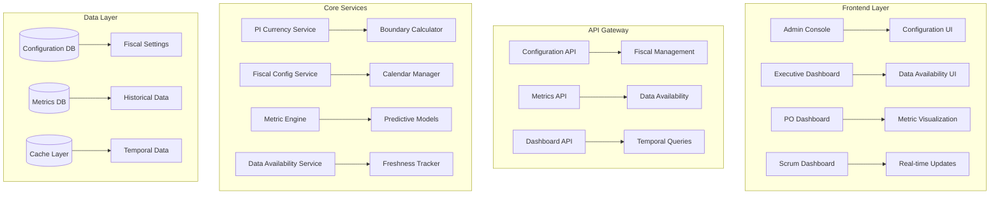

# PI Currency and Fiscal Configuration System Design

## Executive Summary

The PI Currency and Fiscal Configuration System is a comprehensive solution for managing Program Increment (PI) timing, fiscal configurations, and dynamic metric calculations within the QVF platform. This system addresses the critical reality that Business Value data availability is time-dependent and varies based on PI phase progression.

**Key Capabilities:**
- Dynamic PI currency determination and boundary management
- Flexible fiscal year and organizational calendar configuration
- Progressive data availability tracking with predictive modeling
- Multi-dashboard support with clear data freshness indicators
- Enterprise-grade configuration management with audit trails

## System Architecture

### High-Level Architecture



### Core Components

#### 1. PI Currency Service
Manages Program Increment timing and boundary calculations:

```typescript
interface PICurrencyService {
  getCurrentPI(): Promise<ProgramIncrement>;
  getPIBoundaries(piId: string): Promise<PIBoundaries>;
  calculateDataAvailability(piId: string, currentDate: Date): Promise<DataAvailabilityMatrix>;
  getPIPhase(piId: string, currentDate: Date): Promise<PIPhase>;
}

interface ProgramIncrement {
  id: string;
  number: number;
  name: string;
  startDate: Date;
  endDate: Date;
  planningStartDate: Date;
  planningEndDate: Date;
  executionPhases: ExecutionPhase[];
  inspectAdaptDate: Date;
  innovationPlanningDate: Date;
}

interface PIBoundaries {
  piStart: Date;
  piEnd: Date;
  iteration1Start: Date;
  iteration2Start: Date;
  iteration3Start: Date;
  iteration4Start: Date;
  iteration5Start: Date;
  inspectAdaptStart: Date;
  innovationPlanningStart: Date;
}

interface PIPhase {
  name: 'Planning' | 'Iteration1' | 'Iteration2' | 'Iteration3' | 'Iteration4' | 'Iteration5' | 'InspectAdapt' | 'InnovationPlanning';
  startDate: Date;
  endDate: Date;
  weekNumber: number;
  businessDaysRemaining: number;
}
```

#### 2. Fiscal Configuration Service
Handles organizational calendar and fiscal year management:

```typescript
interface FiscalConfigService {
  getFiscalConfiguration(orgId: string): Promise<FiscalConfiguration>;
  updateFiscalConfiguration(config: FiscalConfiguration): Promise<void>;
  calculateFiscalPeriods(fiscalYear: number): Promise<FiscalPeriod[]>;
  alignPIWithFiscal(piId: string): Promise<PIFiscalAlignment>;
}

interface FiscalConfiguration {
  organizationId: string;
  fiscalYearStart: {
    month: number; // 1-12
    day: number;   // 1-31
  };
  fiscalQuarters: FiscalQuarter[];
  holidays: Holiday[];
  blackoutPeriods: BlackoutPeriod[];
  workingDays: WorkingDayConfig;
  timeZone: string;
  customCalendarRules: CalendarRule[];
}

interface FiscalQuarter {
  quarter: 'Q1' | 'Q2' | 'Q3' | 'Q4';
  startDate: Date;
  endDate: Date;
  businessDays: number;
  associatedPIs: string[];
}

interface Holiday {
  name: string;
  date: Date;
  type: 'Federal' | 'Company' | 'Religious' | 'Regional';
  impactLevel: 'Full' | 'Partial' | 'None';
}

interface BlackoutPeriod {
  name: string;
  startDate: Date;
  endDate: Date;
  reason: string;
  impactedActivities: string[];
}
```

#### 3. Data Availability Matrix Service
Tracks which metrics are available at different PI phases:

```typescript
interface DataAvailabilityService {
  getDataAvailabilityMatrix(piId: string, date: Date): Promise<DataAvailabilityMatrix>;
  updateDataAvailability(piId: string, metric: string, status: DataStatus): Promise<void>;
  getPredictedAvailability(piId: string, futureDate: Date): Promise<PredictedAvailability>;
}

interface DataAvailabilityMatrix {
  piId: string;
  asOfDate: Date;
  metrics: MetricAvailability[];
  overallCompleteness: number; // 0-1
  estimatedCompletionDate: Date;
}

interface MetricAvailability {
  metricName: string;
  category: 'Value' | 'Cost' | 'Velocity' | 'Productivity' | 'Reuse' | 'Efficiency';
  status: DataStatus;
  availableDate: Date | null;
  estimatedDate: Date | null;
  confidence: number; // 0-1
  dataSource: string;
  lastUpdated: Date;
}

enum DataStatus {
  NOT_AVAILABLE = 'not_available',
  ESTIMATED = 'estimated',
  PARTIAL = 'partial',
  AVAILABLE = 'available',
  VALIDATED = 'validated'
}

interface PredictedAvailability {
  predictions: MetricPrediction[];
  modelVersion: string;
  confidence: number;
  lastTrainingDate: Date;
}

interface MetricPrediction {
  metricName: string;
  predictedValue: number;
  confidence: number;
  historicalBasis: HistoricalDataPoint[];
  uncertaintyRange: {
    lower: number;
    upper: number;
  };
}
```

## Business Rules for Data Availability

### PI Phase-Based Data Availability

```typescript
const DATA_AVAILABILITY_RULES: Record<PIPhase['name'], MetricAvailability[]> = {
  'Planning': [
    {
      metricName: 'Business Value Proposed',
      category: 'Value',
      status: DataStatus.AVAILABLE,
      availableDate: new Date(), // PI Start
      confidence: 1.0
    }
    // All other metrics: NOT_AVAILABLE or ESTIMATED
  ],
  'Iteration1': [
    {
      metricName: 'Story Points Planned',
      category: 'Velocity',
      status: DataStatus.AVAILABLE,
      confidence: 1.0
    },
    {
      metricName: 'Team Capacity',
      category: 'Productivity',
      status: DataStatus.AVAILABLE,
      confidence: 0.9
    }
    // Cost metrics: ESTIMATED
  ],
  'Iteration2': [
    {
      metricName: 'Velocity Trend',
      category: 'Velocity',
      status: DataStatus.PARTIAL,
      confidence: 0.7
    },
    {
      metricName: 'Burn Rate',
      category: 'Cost',
      status: DataStatus.ESTIMATED,
      confidence: 0.6
    }
  ],
  // ... continued for all phases
};
```

### Metric Calculation Logic

```typescript
interface MetricEngine {
  calculateQVFMetrics(piId: string, date: Date): Promise<QVFMetrics>;
  getAvailableMetrics(piId: string, date: Date): Promise<AvailableMetrics>;
  predictMissingMetrics(piId: string, requiredMetrics: string[]): Promise<PredictedMetrics>;
}

interface QVFMetrics {
  quality: QualityMetrics;
  value: ValueMetrics;
  flow: FlowMetrics;
  dataFreshness: DataFreshness;
}

interface QualityMetrics {
  defectDensity: MetricValue;
  testCoverage: MetricValue;
  technicalDebt: MetricValue;
  customerSatisfaction: MetricValue;
}

interface ValueMetrics {
  businessValueProposed: MetricValue;
  businessValueDelivered: MetricValue;
  costOfDelay: MetricValue;
  netPresentValue: MetricValue;
}

interface FlowMetrics {
  leadTime: MetricValue;
  cycleTime: MetricValue;
  throughput: MetricValue;
  workInProgress: MetricValue;
}

interface MetricValue {
  value: number;
  status: DataStatus;
  confidence: number;
  lastUpdated: Date;
  source: 'Actual' | 'Predicted' | 'Historical';
  trend: 'Improving' | 'Stable' | 'Declining' | 'Unknown';
}
```

## Data Models

### Configuration Schema

```sql
-- Fiscal Configuration Table
CREATE TABLE fiscal_configurations (
    id UUID PRIMARY KEY DEFAULT gen_random_uuid(),
    organization_id UUID NOT NULL,
    fiscal_year_start_month INTEGER NOT NULL CHECK (fiscal_year_start_month BETWEEN 1 AND 12),
    fiscal_year_start_day INTEGER NOT NULL CHECK (fiscal_year_start_day BETWEEN 1 AND 31),
    time_zone VARCHAR(50) NOT NULL DEFAULT 'UTC',
    working_days JSONB NOT NULL DEFAULT '{"monday":true,"tuesday":true,"wednesday":true,"thursday":true,"friday":true,"saturday":false,"sunday":false}',
    created_at TIMESTAMP WITH TIME ZONE DEFAULT NOW(),
    updated_at TIMESTAMP WITH TIME ZONE DEFAULT NOW(),
    created_by UUID NOT NULL,
    UNIQUE(organization_id)
);

-- Program Increment Table
CREATE TABLE program_increments (
    id UUID PRIMARY KEY DEFAULT gen_random_uuid(),
    organization_id UUID NOT NULL,
    pi_number INTEGER NOT NULL,
    name VARCHAR(255) NOT NULL,
    start_date DATE NOT NULL,
    end_date DATE NOT NULL,
    planning_start_date DATE NOT NULL,
    planning_end_date DATE NOT NULL,
    inspect_adapt_date DATE NOT NULL,
    innovation_planning_date DATE NOT NULL,
    fiscal_quarter VARCHAR(10),
    fiscal_year INTEGER,
    status VARCHAR(50) NOT NULL DEFAULT 'Planning',
    created_at TIMESTAMP WITH TIME ZONE DEFAULT NOW(),
    UNIQUE(organization_id, pi_number)
);

-- PI Iterations Table
CREATE TABLE pi_iterations (
    id UUID PRIMARY KEY DEFAULT gen_random_uuid(),
    pi_id UUID NOT NULL REFERENCES program_increments(id),
    iteration_number INTEGER NOT NULL CHECK (iteration_number BETWEEN 1 AND 5),
    start_date DATE NOT NULL,
    end_date DATE NOT NULL,
    business_days INTEGER NOT NULL,
    created_at TIMESTAMP WITH TIME ZONE DEFAULT NOW(),
    UNIQUE(pi_id, iteration_number)
);

-- Holidays Table
CREATE TABLE holidays (
    id UUID PRIMARY KEY DEFAULT gen_random_uuid(),
    organization_id UUID NOT NULL,
    name VARCHAR(255) NOT NULL,
    date DATE NOT NULL,
    type VARCHAR(50) NOT NULL CHECK (type IN ('Federal', 'Company', 'Religious', 'Regional')),
    impact_level VARCHAR(20) NOT NULL DEFAULT 'Full' CHECK (impact_level IN ('Full', 'Partial', 'None')),
    is_recurring BOOLEAN DEFAULT FALSE,
    created_at TIMESTAMP WITH TIME ZONE DEFAULT NOW()
);

-- Data Availability Tracking
CREATE TABLE metric_availability (
    id UUID PRIMARY KEY DEFAULT gen_random_uuid(),
    pi_id UUID NOT NULL REFERENCES program_increments(id),
    metric_name VARCHAR(255) NOT NULL,
    category VARCHAR(50) NOT NULL CHECK (category IN ('Value', 'Cost', 'Velocity', 'Productivity', 'Reuse', 'Efficiency')),
    status VARCHAR(50) NOT NULL CHECK (status IN ('not_available', 'estimated', 'partial', 'available', 'validated')),
    available_date DATE,
    estimated_date DATE,
    confidence DECIMAL(3,2) CHECK (confidence >= 0 AND confidence <= 1),
    data_source VARCHAR(255),
    last_updated TIMESTAMP WITH TIME ZONE DEFAULT NOW(),
    UNIQUE(pi_id, metric_name)
);

-- Metric Values with Temporal Tracking
CREATE TABLE metric_values (
    id UUID PRIMARY KEY DEFAULT gen_random_uuid(),
    pi_id UUID NOT NULL REFERENCES program_increments(id),
    metric_name VARCHAR(255) NOT NULL,
    value DECIMAL(12,4),
    status VARCHAR(50) NOT NULL,
    confidence DECIMAL(3,2),
    source_type VARCHAR(20) NOT NULL CHECK (source_type IN ('Actual', 'Predicted', 'Historical')),
    trend VARCHAR(20) CHECK (trend IN ('Improving', 'Stable', 'Declining', 'Unknown')),
    recorded_date DATE NOT NULL,
    created_at TIMESTAMP WITH TIME ZONE DEFAULT NOW()
);

-- Create indexes for performance
CREATE INDEX idx_fiscal_config_org ON fiscal_configurations(organization_id);
CREATE INDEX idx_pi_org_number ON program_increments(organization_id, pi_number);
CREATE INDEX idx_pi_dates ON program_increments(start_date, end_date);
CREATE INDEX idx_metric_availability_pi ON metric_availability(pi_id, metric_name);
CREATE INDEX idx_metric_values_pi_date ON metric_values(pi_id, recorded_date);
```

## Admin UI Specifications

### Fiscal Configuration Dashboard

```typescript
interface FiscalConfigurationUI {
  components: {
    fiscalYearConfig: FiscalYearConfigComponent;
    quarterBreakdown: QuarterBreakdownComponent;
    holidayManagement: HolidayManagementComponent;
    piAlignment: PIAlignmentComponent;
    calendarPreview: CalendarPreviewComponent;
  };
}

interface FiscalYearConfigComponent {
  fields: {
    fiscalYearStartMonth: DropdownField;
    fiscalYearStartDay: NumberField;
    timeZone: TimezoneSelector;
    workingDays: WeekdaySelector;
  };
  validation: {
    validateFiscalYearStart: (month: number, day: number) => ValidationResult;
    checkPIAlignment: () => Promise<AlignmentWarning[]>;
  };
}

interface QuarterBreakdownComponent {
  display: {
    quarterCards: QuarterCard[];
    businessDaysCalculation: BusinessDaysDisplay;
    piMappingVisualization: PIQuarterMapping;
  };
  interactions: {
    adjustQuarterBoundaries: (quarter: string, newBoundary: Date) => void;
    viewQuarterDetails: (quarter: string) => QuarterDetailsModal;
  };
}

interface HolidayManagementComponent {
  features: {
    holidayCalendar: InteractiveCalendar;
    holidayList: SortableTable;
    importHolidays: FileUploader;
    recurringHolidays: RecurringHolidayConfig;
  };
  actions: {
    addHoliday: (holiday: Holiday) => void;
    editHoliday: (id: string, changes: Partial<Holiday>) => void;
    deleteHoliday: (id: string) => void;
    bulkImport: (file: File) => Promise<ImportResult>;
  };
}
```

### PI Management Interface

```typescript
interface PIManagementUI {
  layout: {
    header: PIHeaderComponent;
    timeline: PITimelineComponent;
    dataAvailability: DataAvailabilityMatrix;
    metrics: MetricsPanel;
  };
}

interface PIHeaderComponent {
  display: {
    currentPI: PIStatusCard;
    upcomingPI: PIPreviewCard;
    phaseIndicator: PIPhaseIndicator;
  };
  actions: {
    createNewPI: () => void;
    editCurrentPI: () => void;
    planNextPI: () => void;
  };
}

interface PITimelineComponent {
  visualization: {
    ganttChart: PIGanttChart;
    milestoneMarkers: MilestoneMarkers;
    criticalPath: CriticalPathHighlight;
  };
  interactions: {
    zoomToPhase: (phase: PIPhase['name']) => void;
    dragToAdjust: (milestone: string, newDate: Date) => void;
    showDependencies: (milestone: string) => void;
  };
}

interface DataAvailabilityMatrix {
  grid: {
    rows: MetricRow[];
    columns: PIPhaseColumn[];
    cells: AvailabilityCell[];
  };
  legend: {
    statusColors: StatusColorMapping;
    confidenceLevels: ConfidenceLevelMapping;
  };
  filters: {
    metricCategory: CategoryFilter;
    confidenceThreshold: RangeSlider;
    dateRange: DateRangePicker;
  };
}
```

## API Contracts

### Configuration Management APIs

```typescript
// GET /api/v1/fiscal/configuration/{organizationId}
interface GetFiscalConfigurationResponse {
  configuration: FiscalConfiguration;
  derivedQuarters: FiscalQuarter[];
  upcomingHolidays: Holiday[];
  validationWarnings: ValidationWarning[];
}

// POST /api/v1/fiscal/configuration
interface UpdateFiscalConfigurationRequest {
  organizationId: string;
  configuration: Partial<FiscalConfiguration>;
  validateOnly?: boolean;
}

interface UpdateFiscalConfigurationResponse {
  success: boolean;
  configuration: FiscalConfiguration;
  warnings: ValidationWarning[];
  impactedPIs: string[];
}

// GET /api/v1/pi/current
interface GetCurrentPIResponse {
  currentPI: ProgramIncrement;
  phase: PIPhase;
  dataAvailability: DataAvailabilityMatrix;
  upcomingMilestones: Milestone[];
}

// GET /api/v1/pi/{piId}/metrics
interface GetPIMetricsRequest {
  piId: string;
  date?: string; // ISO date
  includeEstimated?: boolean;
  confidenceThreshold?: number;
}

interface GetPIMetricsResponse {
  metrics: QVFMetrics;
  dataFreshness: DataFreshness;
  predictedMetrics: PredictedMetrics;
  recommendations: MetricRecommendation[];
}
```

### Data Availability APIs

```typescript
// GET /api/v1/availability/matrix/{piId}
interface GetAvailabilityMatrixRequest {
  piId: string;
  asOfDate?: string;
  projection?: boolean;
}

interface GetAvailabilityMatrixResponse {
  matrix: DataAvailabilityMatrix;
  projections: FutureAvailabilityProjection[];
  recommendations: AvailabilityRecommendation[];
}

// POST /api/v1/availability/update
interface UpdateAvailabilityRequest {
  piId: string;
  updates: MetricAvailabilityUpdate[];
  source: string;
  timestamp: string;
}

interface MetricAvailabilityUpdate {
  metricName: string;
  newStatus: DataStatus;
  confidence?: number;
  actualValue?: number;
  notes?: string;
}

// GET /api/v1/prediction/metrics/{piId}
interface GetMetricPredictionsRequest {
  piId: string;
  metrics: string[];
  horizon: number; // days ahead
  confidence: number; // minimum confidence
}

interface GetMetricPredictionsResponse {
  predictions: MetricPrediction[];
  modelInfo: PredictionModelInfo;
  disclaimers: string[];
}
```

## Dashboard Visualization Strategies

### Executive Dashboard Strategy

```typescript
interface ExecutiveDashboardStrategy {
  layout: {
    summary: ExecutiveSummaryPanel;
    trends: TrendVisualization;
    forecasts: ForecastPanel;
    risks: RiskIndicators;
  };
  
  dataApproach: {
    showAvailableData: 'Emphasize actual data with clear timestamps';
    indicateEstimated: 'Visual distinction for estimated vs actual';
    confidenceVisualization: 'Confidence bands around predictions';
    progressiveEnhancement: 'Update in real-time as data becomes available';
  };
  
  visualizations: {
    qvfScorecard: QVFScorecardWidget;
    valueRealizationChart: ValueRealizationChart;
    flowMetricsTimeline: FlowMetricsTimeline;
    riskHeatmap: RiskHeatmapWidget;
  };
}

interface QVFScorecardWidget {
  display: {
    currentScores: QVFScores;
    trendIndicators: TrendArrows;
    confidenceBands: ConfidenceBands;
    dataFreshnessIndicators: FreshnessIndicators;
  };
  
  interactions: {
    drillDownToDetails: (metric: string) => void;
    viewHistoricalTrend: (metric: string) => void;
    compareWithBenchmarks: () => void;
  };
}

interface ValueRealizationChart {
  chartType: 'waterfall' | 'cumulative' | 'comparison';
  dataPoints: {
    businessValueProposed: DataPoint;
    businessValueDelivered: DataPoint;
    costOfDelay: DataPoint;
    netRealizedValue: DataPoint;
  };
  annotations: {
    estimatedDataMarkers: EstimatedDataMarker[];
    confidenceIntervals: ConfidenceInterval[];
    milestoneMarkers: MilestoneMarker[];
  };
}
```

### PO Dashboard Strategy

```typescript
interface PODashboardStrategy {
  focus: 'Feature delivery, value realization, team performance';
  
  layout: {
    featureProgress: FeatureProgressPanel;
    valueMetrics: ValueMetricsPanel;
    teamPerformance: TeamPerformancePanel;
    backlogHealth: BacklogHealthPanel;
  };
  
  dataFreshnessStrategy: {
    realTimeUpdates: 'Live updates for velocity and throughput';
    batchUpdates: 'Hourly updates for business value metrics';
    predictiveDisplay: 'Show predicted completion dates with confidence';
    alertThresholds: 'Warn when data is stale beyond acceptable limits';
  };
  
  visualizations: {
    burnupChart: BurnupChartWithPredictions;
    velocityTrend: VelocityTrendChart;
    valueDeliveryPipeline: ValueDeliveryPipeline;
    teamCapacityUtilization: CapacityUtilizationChart;
  };
}

interface BurnupChartWithPredictions {
  actualProgress: ProgressLine;
  predictedCompletion: PredictionLine;
  confidenceBands: ConfidenceBand[];
  milestones: MilestoneMarker[];
  dataFreshness: FreshnessIndicator;
}

interface VelocityTrendChart {
  historicalVelocity: VelocityDataPoint[];
  currentSprintVelocity: CurrentVelocityIndicator;
  predictedVelocity: PredictedVelocityRange;
  capacityLine: CapacityIndicator;
  confidenceMetrics: VelocityConfidence;
}
```

### Scrum Team Dashboard Strategy

```typescript
interface ScrumTeamDashboardStrategy {
  focus: 'Sprint execution, impediment resolution, team health';
  
  layout: {
    sprintProgress: SprintProgressPanel;
    dailyMetrics: DailyMetricsPanel;
    impediments: ImpedimentTracker;
    teamHealth: TeamHealthIndicators;
  };
  
  realTimeStrategy: {
    wsConnections: 'WebSocket connections for live updates';
    pushNotifications: 'Push notifications for critical changes';
    autoRefresh: 'Smart refresh based on user activity';
    offlineSupport: 'Cached data for offline viewing';
  };
  
  visualizations: {
    sprintBurndown: RealTimeSprintBurndown;
    dailyCommitments: DailyCommitmentTracker;
    codeQualityMetrics: LiveQualityMetrics;
    teamMoodTracker: TeamMoodVisualization;
  };
}

interface RealTimeSprintBurndown {
  idealBurndown: IdealBurndownLine;
  actualBurndown: ActualBurndownLine;
  predictedCompletion: PredictionCone;
  dailyUpdates: DailyUpdateMarkers;
  riskIndicators: BurndownRiskIndicators;
}
```

## Caching Strategies for Temporal Data

### Multi-Layer Caching Architecture

```typescript
interface TemporalCachingStrategy {
  layers: {
    l1Browser: BrowserCache;
    l2Application: ApplicationCache;
    l3Database: DatabaseCache;
    l4Predictive: PredictiveCache;
  };
  
  policies: {
    piCurrentData: CachePolicy;
    historicalMetrics: CachePolicy;
    predictions: CachePolicy;
    configurations: CachePolicy;
  };
}

interface CachePolicy {
  ttl: number; // Time to live in seconds
  refreshStrategy: 'lazy' | 'eager' | 'predictive';
  invalidationTriggers: string[];
  compressionEnabled: boolean;
  encryptionRequired: boolean;
}

const CACHE_POLICIES: Record<string, CachePolicy> = {
  piCurrentData: {
    ttl: 300, // 5 minutes
    refreshStrategy: 'eager',
    invalidationTriggers: ['pi_phase_change', 'metric_update'],
    compressionEnabled: true,
    encryptionRequired: false
  },
  
  historicalMetrics: {
    ttl: 86400, // 24 hours
    refreshStrategy: 'lazy',
    invalidationTriggers: ['data_correction'],
    compressionEnabled: true,
    encryptionRequired: false
  },
  
  predictions: {
    ttl: 3600, // 1 hour
    refreshStrategy: 'predictive',
    invalidationTriggers: ['model_update', 'significant_deviation'],
    compressionEnabled: true,
    encryptionRequired: false
  },
  
  configurations: {
    ttl: 3600, // 1 hour
    refreshStrategy: 'eager',
    invalidationTriggers: ['config_change', 'fiscal_year_rollover'],
    compressionEnabled: false,
    encryptionRequired: true
  }
};
```

### Smart Cache Warming

```typescript
interface SmartCacheWarming {
  triggers: {
    userLogin: 'Pre-load likely needed data based on role';
    piTransition: 'Pre-calculate new PI metrics and availability';
    fiscalRollover: 'Update all fiscal-dependent calculations';
    modelUpdate: 'Refresh prediction caches with new model';
  };
  
  strategies: {
    predictiveLoading: PredictiveLoadingStrategy;
    batchProcessing: BatchProcessingStrategy;
    prioritization: CachePrioritizationStrategy;
  };
}

interface PredictiveLoadingStrategy {
  userBehaviorAnalysis: 'Track common navigation patterns';
  timeBasedPrediction: 'Pre-load data for likely time periods';
  roleBasedCaching: 'Cache role-specific data subsets';
  contextAwareness: 'Consider current PI phase and date';
}
```

## Implementation Phases

### Phase 1: Core Infrastructure (Weeks 1-4)
- **Week 1-2**: Database schema implementation and basic PI currency service
- **Week 3**: Fiscal configuration service and basic admin UI
- **Week 4**: Data availability matrix service and API contracts

### Phase 2: Dashboard Integration (Weeks 5-8)
- **Week 5**: Executive dashboard with data availability indicators
- **Week 6**: PO dashboard with progressive enhancement
- **Week 7**: Scrum team dashboard with real-time updates
- **Week 8**: Testing, optimization, and performance tuning

### Phase 3: Advanced Features (Weeks 9-12)
- **Week 9**: Predictive modeling integration
- **Week 10**: Advanced caching and temporal optimization
- **Week 11**: Admin UI enhancement and bulk operations
- **Week 12**: Documentation, training, and rollout preparation

## Success Metrics

### System Performance Metrics
- **API Response Time**: < 200ms for configuration queries, < 500ms for complex metric calculations
- **Cache Hit Rate**: > 90% for temporal data, > 95% for configuration data  
- **Data Freshness**: 99% of available metrics updated within SLA (5 minutes for real-time, 1 hour for batch)
- **Prediction Accuracy**: > 85% for velocity predictions, > 75% for value realization

### Business Impact Metrics
- **Dashboard Usage**: > 80% daily active usage across all three dashboard types
- **Data-Driven Decisions**: 50% reduction in decisions made with stale/missing data
- **PI Planning Efficiency**: 30% reduction in planning time due to better data availability
- **Stakeholder Confidence**: > 4.0/5.0 satisfaction score with data transparency

### Technical Quality Metrics
- **System Availability**: 99.9% uptime for core services
- **Data Accuracy**: < 1% discrepancy between predicted and actual values when data becomes available
- **Configuration Flexibility**: Support for 95% of common fiscal year configurations without custom code
- **Scalability**: Handle 10,000+ concurrent users with < 2x performance degradation

## Security and Compliance Considerations

### Data Security
- **Encryption**: All fiscal and business value data encrypted at rest and in transit
- **Access Control**: Role-based access to configuration and historical data
- **Audit Trail**: Complete audit log for all configuration changes and data access
- **Data Retention**: Configurable retention policies for historical metrics and predictions

### Compliance Requirements
- **SOX Compliance**: Immutable audit trail for financial data and fiscal configurations
- **GDPR/Privacy**: Personal data handling for team performance metrics
- **Industry Standards**: Integration with existing enterprise security frameworks
- **Data Governance**: Clear data ownership and stewardship for all metrics

This comprehensive design provides a robust foundation for managing PI currency and fiscal configurations while addressing the complex reality of time-dependent business value data availability in Agile environments.