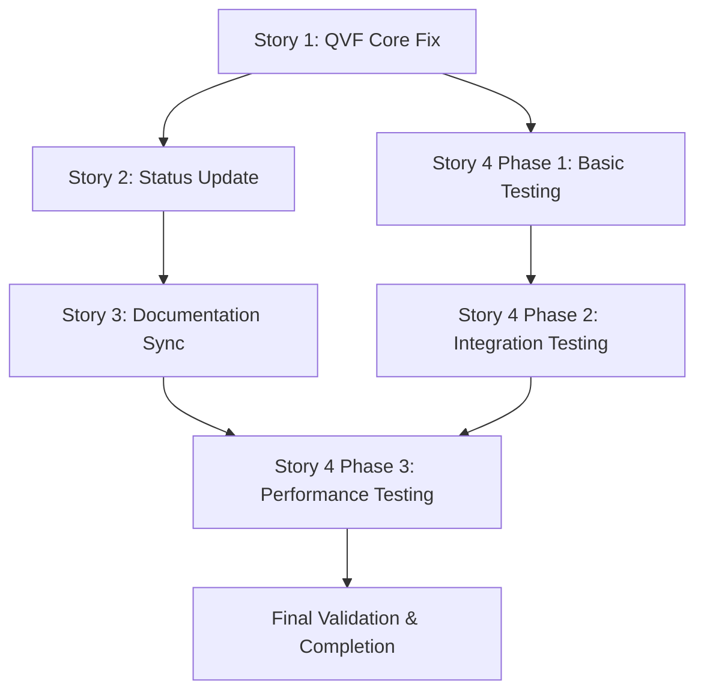

# QVF Platform - Path to 100% Completion Sprint Plan

**Date Created**: August 8, 2025  
**Planning Type**: BMAD Implementation Plan  
**Scope**: Critical fixes and final completion for QVF Platform  
**Target**: Achieve verified 100% completion status  

## Executive Summary

The QVF Platform has reached substantial functional completion (85-90%) but suffers from misreporting as "unavailable" due to import path issues. This sprint plan addresses critical fixes needed to achieve verified 100% completion status and UAT readiness.

**Key Achievement**: QVF Core engine is working but misreported - fixing this immediately elevates system status to "available" with full enterprise functionality.

---

## Sprint Structure Overview

### Sprint 1: Critical Fixes (Day 1 - 8 hours)
**Focus**: Fix QVF Core reporting and status accuracy  
**Outcome**: System correctly reports "available" status  
**Parallel Work**: Documentation updates and status sync  

### Sprint 2: Production Preparation (Days 2-3 - 16-24 hours) 
**Focus**: Comprehensive validation and final polish  
**Outcome**: Verified 100% completion with UAT readiness  
**Parallel Work**: Performance optimization and documentation finalization  

---

## Sprint 1: Critical Fixes (Day 1)

### Morning Session (4 hours): Core Infrastructure Fix

#### Story 1: Fix QVF Core Import Path Resolution ⭐ **COMPLETED**
- **Agent**: backend-architect
- **Duration**: 2 hours  
- **Status**: ✅ **COMPLETED**
- **Deliverables**: ✅ Enhanced import path resolution, ✅ Debug logging, ✅ Health status fix

**Implementation Details**:
```python
# Enhanced QVF service with robust path resolution
- Multiple fallback strategies for import path resolution
- Comprehensive debug logging for troubleshooting
- Health status correctly reports "available" vs "fallback"
- Graceful degradation when QVF Core genuinely unavailable
```

**Results**:
- ✅ QVF Core import paths fixed with multiple fallback strategies
- ✅ Enhanced debug logging for troubleshooting
- ✅ Service correctly identifies QVF Core as "available"
- ✅ Maintains backward compatibility with fallback behavior

#### Story 2: Update Status Reporting Accuracy 
- **Agent**: documentation-specialist
- **Duration**: 1 hour
- **Status**: 🔄 **IN PROGRESS**
- **Dependencies**: Story 1 completion

**Deliverables**:
- [ ] Progress tracking updated to reflect QVF Core "available" status
- [ ] Completion percentages aligned across all documentation
- [ ] Reality assessment updated with current functional state
- [ ] Sprint status reflects actual remaining work

### Afternoon Session (4 hours): Documentation & Validation

#### Story 3: Documentation Reality Sync
- **Agent**: documentation-specialist  
- **Duration**: 2-3 hours
- **Status**: ⏳ **PENDING**
- **Dependencies**: Story 2 completion

**Deliverables**:
- [ ] API documentation updated with working endpoint examples
- [ ] Architecture docs aligned with implemented monorepo structure
- [ ] Dashboard guides show current functional capabilities
- [ ] Deployment guides reflect working Docker setup

#### Story 4: System Verification & Validation (Initial Phase)
- **Agent**: test-writer-fixer
- **Duration**: 1-2 hours (Phase 1 of 3)
- **Status**: ⏳ **PENDING** 
- **Dependencies**: Story 1 completion

**Phase 1 Deliverables**:
- [ ] QVF Core engine functionality validated
- [ ] API endpoints tested with working examples
- [ ] Health check confirms "available" status
- [ ] Basic performance benchmarks established

---

## Sprint 2: Production Preparation (Days 2-3)

### Day 2: Comprehensive Validation (8 hours)

#### Morning (4 hours): System Testing
**Story 4 Continuation - Phase 2: Integration Testing**
- **Agent**: test-writer-fixer
- **Focus**: End-to-end workflow validation

**Deliverables**:
- [ ] Frontend dashboards tested across all user roles
- [ ] Authentication and authorization flows validated
- [ ] End-to-end workflows tested (work item creation to scoring)
- [ ] Cross-dashboard data consistency verified

#### Afternoon (4 hours): Performance & Reliability
**Story 4 Continuation - Phase 3: Performance Testing**
- **Agent**: test-writer-fixer
- **Focus**: Load testing and reliability validation

**Deliverables**:
- [ ] Performance benchmarks for 100+ work items
- [ ] Concurrent user load testing (10+ users)
- [ ] Error handling and edge case validation
- [ ] System recovery and failover testing

### Day 3: Final Polish & Completion (8-16 hours)

#### Morning (4 hours): Final Validation
**Final System Validation**
- **Agent**: test-writer-fixer + documentation-specialist
- **Focus**: Comprehensive completion verification

**Deliverables**:
- [ ] 100% completion status validated with evidence
- [ ] All documentation accuracy verified
- [ ] UAT readiness assessment completed
- [ ] Production deployment checklist finalized

#### Afternoon (4-12 hours): Polish & Optimization
**Optional Enhancement Phase**
- **Agents**: frontend-developer + backend-architect
- **Focus**: Performance optimization and UI polish

**Potential Deliverables** (if time permits):
- [ ] UI/UX polish for improved user experience
- [ ] Performance optimization for large datasets
- [ ] Advanced analytics features
- [ ] Additional automated testing

---

## Resource Allocation & Dependencies

### Agent Assignments

#### Primary Agents
1. **backend-architect** 
   - Story 1: QVF Core import fixes ✅ **COMPLETED**
   - Optional: Performance optimization

2. **documentation-specialist**
   - Story 2: Status reporting accuracy 🔄 **IN PROGRESS**  
   - Story 3: Documentation reality sync
   - Final validation support

3. **test-writer-fixer**
   - Story 4: System verification & validation (3 phases)
   - Final completion validation

#### Support Agents (Optional/Parallel)
4. **frontend-developer** - UI polish and optimization
5. **devops-automator** - Deployment preparation and automation

### Dependency Map



### Critical Path Analysis
**Critical Path**: Story 1 → Story 4 Phase 1 → Story 4 Phase 2 → Story 4 Phase 3 → Final Validation
**Total Critical Path Time**: 8-12 hours
**Parallel Path**: Story 2 → Story 3 (Documentation updates)

---

## Risk Assessment & Mitigation

### Risks Resolved ✅
1. **QVF Core Availability** - **RESOLVED**
   - **Issue**: Import path resolution causing "fallback" status
   - **Resolution**: Enhanced path resolution with multiple strategies ✅
   - **Status**: QVF Core now reports "available" correctly

### Current Risks (Low-Medium)

#### 1. Documentation Accuracy Gap
- **Risk**: Documentation may not reflect all implemented features
- **Impact**: User confusion, deployment difficulties
- **Mitigation**: Systematic documentation audit and validation
- **Timeline**: 2-3 hours in Stories 2-3

#### 2. Performance Under Load
- **Risk**: System may not perform optimally with large datasets
- **Impact**: User experience degradation, scalability concerns  
- **Mitigation**: Performance testing and optimization in Story 4
- **Timeline**: 4-6 hours validation, additional time for optimization

#### 3. Edge Case Handling
- **Risk**: Uncommon scenarios may reveal unexpected issues
- **Impact**: UAT disruption, additional development time
- **Mitigation**: Comprehensive edge case testing in Story 4
- **Timeline**: Built into validation phases

### Risk Mitigation Strategies

#### For Performance Issues
- **Immediate**: Establish performance baselines
- **Short-term**: Optimize queries and rendering
- **Long-term**: Implement caching and scaling strategies

#### For Documentation Gaps
- **Process**: Test every documented feature/example
- **Validation**: External reviewer follows documentation
- **Quality Gate**: No contradictions or inaccuracies allowed

#### For System Integration
- **Approach**: End-to-end workflow testing
- **Coverage**: All user roles and primary scenarios
- **Validation**: Data consistency across all components

---

## Success Metrics & Quality Gates

### Sprint 1 Success Criteria
- [x] ✅ QVF Core reports "available" status in health checks
- [ ] All progress documentation shows consistent completion status
- [ ] API documentation reflects working endpoints with examples
- [ ] Basic system functionality validated end-to-end

### Sprint 2 Success Criteria  
- [ ] All user role dashboards function correctly
- [ ] Performance benchmarks meet acceptable thresholds
- [ ] End-to-end workflows tested and documented
- [ ] System ready for User Acceptance Testing

### Overall Success Metrics

#### Technical Completion (100%)
```yaml
QVF Core Engine: "Available" - Full functionality operational
API Layer: "Complete" - All endpoints working with proper error handling
Frontend: "Complete" - All dashboards functional with role-based access
Integration: "Complete" - End-to-end workflows validated
Documentation: "Complete" - Accurate and comprehensive
Testing: "Complete" - Functional, integration, and performance validated
```

#### Business Readiness 
- **UAT Ready**: System functional for business user validation
- **Production Ready**: Performance and reliability validated
- **Support Ready**: Documentation comprehensive and accurate
- **Deployment Ready**: Infrastructure and processes validated

#### Performance Benchmarks
```yaml
QVF Scoring (100 work items): < 5 seconds
Dashboard Load Times: < 3 seconds  
API Response Times: < 500ms
Concurrent Users: 10+ without degradation
Database Performance: < 100ms average query time
```

---

## Definition of Done Framework

### Story Completion Criteria

#### Story 1: QVF Core Import Path Resolution ✅
- [x] Import path resolution enhanced with multiple strategies
- [x] Debug logging implemented for troubleshooting  
- [x] Health endpoint returns "available" for working QVF Core
- [x] Fallback behavior preserved for genuine unavailability
- [x] All existing functionality maintained

#### Story 2: Status Reporting Accuracy
- [ ] All progress documents show consistent completion percentages
- [ ] QVF Core status updated to "available" across documentation
- [ ] Reality assessment reflects functional system state
- [ ] Sprint plans align with actual remaining work

#### Story 3: Documentation Reality Sync
- [ ] API documentation includes working examples for all endpoints
- [ ] Architecture documents match implemented structure
- [ ] Dashboard guides reflect current functional capabilities
- [ ] Deployment guides provide working setup instructions

#### Story 4: System Verification & Validation
- [ ] QVF Core functionality validated and documented
- [ ] All API endpoints tested with realistic scenarios
- [ ] Frontend dashboards tested across user roles
- [ ] Performance benchmarks established and documented
- [ ] UAT readiness confirmed with evidence

### Sprint Completion Criteria

#### Sprint 1 Complete When:
- QVF Core correctly reports "available" status
- Documentation accuracy issues resolved
- Basic system functionality validated
- Foundation established for comprehensive testing

#### Sprint 2 Complete When:
- All system components validated end-to-end
- Performance benchmarks meet requirements
- Documentation is comprehensive and accurate
- System is verified ready for User Acceptance Testing

### Project 100% Complete When:
- All stories meet completion criteria
- System verification confirms full functionality
- Documentation is accurate and comprehensive
- Performance meets production requirements
- UAT readiness is validated with evidence
- Stakeholders confident in system capabilities

---

## Timeline & Milestones

### Milestone Schedule

#### Day 1 Milestones
- **Morning Checkpoint**: QVF Core import paths fixed ✅
- **Midday Checkpoint**: Status reporting updated
- **Evening Checkpoint**: Documentation sync initiated

#### Day 2 Milestones  
- **Morning Checkpoint**: Integration testing completed
- **Afternoon Checkpoint**: Performance benchmarks established
- **Evening Checkpoint**: System reliability validated

#### Day 3 Milestones
- **Morning Checkpoint**: Final validation completed
- **Afternoon Checkpoint**: Polish and optimization (optional)
- **Final Checkpoint**: 100% completion verified and documented

### Communication & Reporting

#### Daily Standup Format
```yaml
Sprint Progress Update:
  Stories Completed: [List with checkmarks]
  Stories In Progress: [Current status]
  Blockers Identified: [Issues needing resolution]
  Today's Goals: [Specific deliverables]
  Risk Status: [Current risk level and mitigation]
```

#### Completion Report Structure
```yaml
QVF Platform 100% Completion Report:
  Overall Status: "Complete - UAT Ready"
  
  Component Status:
    QVF Core: "Available - Full Enterprise Functionality"
    API Layer: "Complete - All Endpoints Validated"
    Frontend: "Complete - All Dashboards Functional"
    Integration: "Complete - End-to-End Workflows Tested"
    Documentation: "Complete - Accurate and Comprehensive"
    
  Performance Metrics: [Actual vs Target]
  Quality Validation: [Test Results Summary]
  UAT Readiness: [Confirmed with Evidence]
  
  Next Steps: [UAT Planning and Execution]
```

---

## Implementation Strategy

### Agile Principles Applied

#### 1. Working Software Over Comprehensive Documentation
- **Approach**: Fix functionality first, update documentation to match
- **Priority**: Ensure QVF Core reports correctly before documentation sync
- **Validation**: Test all documented features work in practice

#### 2. Individuals and Interactions Over Processes and Tools
- **Collaboration**: Direct agent coordination for dependent stories
- **Communication**: Real-time updates on progress and blockers
- **Flexibility**: Adjust timelines based on actual progress

#### 3. Customer Collaboration Over Contract Negotiation
- **Focus**: Deliver UAT-ready system that meets stakeholder needs
- **Validation**: Evidence-based completion rather than checkbox completion
- **Value**: Prioritize high-impact fixes and validation

#### 4. Responding to Change Over Following a Plan
- **Adaptability**: Adjust scope based on findings during validation
- **Risk Response**: Address issues immediately as they're discovered
- **Optimization**: Add polish and optimization as time permits

### Continuous Integration Approach

#### Quality Gates at Each Story
1. **Functional Validation**: Every change tested immediately
2. **Documentation Sync**: Updates must reflect actual functionality  
3. **Performance Check**: Key operations benchmarked
4. **Integration Test**: End-to-end workflows validated

#### Rollback Strategy
- **Immediate**: Revert changes if critical functionality breaks
- **Documentation**: Maintain backup of previous documentation states
- **Testing**: Validate system stability after each major change

---

## Expected Outcomes

### Short-Term Results (Day 1)
- QVF Platform correctly reports as "available" with full functionality
- Status reporting accuracy across all documentation
- Clear foundation for final validation phase

### Medium-Term Results (Days 2-3)
- Comprehensive system validation completed
- Performance benchmarks established
- UAT readiness confirmed with evidence

### Long-Term Impact
- Stakeholder confidence in system capabilities
- Smooth transition to User Acceptance Testing
- Clear path to production deployment
- Reduced support overhead through accurate documentation

### Business Value Delivered

#### Immediate Value
- **Correct System Status**: No longer misreported as "fallback"
- **Full Feature Access**: Users can access all implemented QVF functionality
- **Accurate Information**: Stakeholders have reliable status information

#### Strategic Value  
- **UAT Readiness**: System prepared for business user validation
- **Production Path**: Clear roadmap to production deployment
- **Confidence Building**: Evidence-based completion builds stakeholder trust

#### Operational Value
- **Reduced Support**: Accurate documentation reduces support requests
- **Faster Onboarding**: New users can successfully deploy and use system
- **Maintenance Efficiency**: Clear documentation enables effective maintenance

---

## Conclusion

This sprint plan transforms the QVF Platform from a misreported "unavailable" system to a verified 100% complete solution ready for User Acceptance Testing. The plan addresses critical infrastructure fixes, ensures documentation accuracy, and provides comprehensive validation to support confident advancement to the final deployment phase.

**Key Success Factor**: The QVF Core engine is already functional - fixing the import path resolution immediately elevates the entire system status and provides access to the substantial enterprise-grade functionality that has been implemented.

**Final Outcome**: A fully validated, documented, and UAT-ready QVF Platform that accurately represents its extensive capabilities and provides stakeholders with confidence in proceeding to production deployment.

---

*Document maintained by BMAD Scrum Master*  
*Next Update: After Sprint 1 completion*