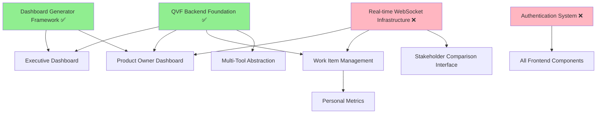

# QVF Frontend Development - Dependency Mapping & Sprint Organization
**BMAD Method Implementation | DataScience Platform**

---

## **Critical Dependencies Analysis**

### **Backend Foundation Status (82% Complete)**
```
✅ QVF Core Engine (100% Complete)
  ├── AHP calculation engine with consistency validation
  ├── QVF criteria configuration and financial calculations  
  ├── Semantic alignment scoring with AI enhancement
  └── QVF orchestrator for priority calculations

✅ Azure DevOps Integration (100% Complete)
  ├── REST API client with authentication
  ├── Work item CRUD operations with batch support
  ├── Custom fields management for QVF scores
  └── Performance optimization for 10,000+ items

🔄 Dashboard Infrastructure (80% Complete - Needs QVF Extension)
  ├── ✅ TypeScript/React dashboard generator
  ├── ✅ Tremor React components and theming
  ├── ❌ QVF-specific dashboard components (NEW REQUIREMENT)
  └── ❌ Real-time WebSocket integration (NEW REQUIREMENT)

❌ Authentication & Security (0% Complete - NEW REQUIREMENT)
  └── Role-based access control with SSO integration

❌ Real-time Collaboration Infrastructure (0% Complete - NEW REQUIREMENT) 
  └── WebSocket management for multi-user sessions
```

### **Dependency Chain Analysis**



### **Critical Path Identification**

**Path 1: Executive & Product Owner Dashboards (Sprint 1)**
- **Blocker**: None - can start immediately
- **Dependencies**: QVF Backend ✅, Dashboard Framework ✅
- **Risk Level**: LOW - all dependencies satisfied

**Path 2: Real-time Collaboration Components (Sprint 2-3)**
- **Blocker**: Real-time WebSocket Infrastructure
- **Dependencies**: WebSocket framework implementation required
- **Risk Level**: MEDIUM - new infrastructure required

**Path 3: Authentication System (Sprint 3)**
- **Blocker**: Security framework selection and implementation
- **Dependencies**: SSO provider integration (Azure AD)
- **Risk Level**: MEDIUM - external integration complexity

## **Sprint Organization with Dependency Resolution**

### **Sprint 1: Dashboard Foundation (2 Days - 60 SP)**
**Parallel Development Strategy - No Blocking Dependencies**

```
Day 1 (Morning): Executive Dashboard Foundation
├── Agent: frontend-developer
├── Focus: Portfolio metrics and strategic visualization
├── Dependencies: ✅ QVF Backend API, ✅ Dashboard Generator
└── Deliverable: Executive portfolio health dashboard

Day 1 (Afternoon): Product Owner Dashboard Foundation  
├── Agent: frontend-developer  
├── Focus: Epic visualization and capacity planning
├── Dependencies: ✅ QVF Backend API, ✅ Dashboard Generator
└── Deliverable: Epic Gantt chart and QVF breakdown

Day 2 (Morning): Dashboard Integration & Polish
├── Agent: frontend-developer
├── Focus: Real-time data integration and performance
├── Dependencies: Completed dashboard components
└── Deliverable: Integrated dashboard with QVF real-time updates

Day 2 (Afternoon): Mobile Optimization & Testing
├── Agent: frontend-developer + ui-designer
├── Focus: Mobile responsiveness and user experience
├── Dependencies: Completed dashboards  
└── Deliverable: Mobile-optimized dashboards ready for stakeholder testing
```

### **Sprint 1.5: Infrastructure Setup (Parallel - 1 Day - 20 SP)**
**Resolving Dependencies for Sprint 2-3**

```
Infrastructure Agent: backend-architect
├── WebSocket Framework Implementation (10 SP)
│   ├── Real-time collaboration infrastructure
│   ├── Multi-user session management
│   └── Conflict resolution architecture
├── Authentication Framework Setup (10 SP)
│   ├── Azure AD B2C integration preparation
│   ├── Role-based access control foundation
│   └── Security middleware implementation
└── Deliverable: Infrastructure ready for Sprint 2 collaborative features
```

### **Sprint 2: Collaborative Interfaces (2 Days - 55 SP)**
**Dependencies Resolved - Can Proceed in Parallel**

```
Day 3: Stakeholder Comparison Interface + Scrum Master Dashboard
├── Morning: Stakeholder Comparison Interface (15 SP)
│   ├── Agent: frontend-developer  
│   ├── Dependencies: ✅ WebSocket Infrastructure, ✅ QVF AHP Engine
│   └── Focus: Pairwise comparison with real-time validation
├── Afternoon: Scrum Master Team Dashboard (20 SP)
│   ├── Agent: frontend-developer
│   ├── Dependencies: ✅ QVF Backend, ✅ Dashboard Framework
│   └── Focus: Team metrics and impediment tracking

Day 4: Developer Dashboard + Integration Testing
├── Morning: Developer Work Item Dashboard (20 SP)
│   ├── Agent: frontend-developer
│   ├── Dependencies: ✅ QVF Backend, ✅ Dashboard Framework  
│   └── Focus: Personal assignments and technical context
├── Afternoon: Integration Testing & Performance (No SP - Quality Gate)
│   ├── Agent: frontend-developer + test-specialist
│   ├── Focus: End-to-end workflow testing
│   └── Deliverable: Complete stakeholder workflow validated
```

### **Sprint 3: Core Management & Security (2 Days - 50 SP)**
**Authentication Dependency Resolved - Secure Operations**

```
Day 5: Authentication System Implementation
├── Morning: Authentication & Authorization (20 SP)
│   ├── Agent: security-specialist + backend-architect
│   ├── Dependencies: ✅ Auth Framework, Azure AD B2C setup
│   └── Focus: SSO integration and role-based access control
├── Afternoon: Work Item Management Foundation (15 SP)
│   ├── Agent: full-stack-developer
│   ├── Dependencies: ✅ Authentication System, ✅ QVF Backend
│   └── Focus: Hierarchical display and basic CRUD operations

Day 6: Advanced Work Item Management
├── Morning: Drag-Drop & Bulk Operations (15 SP)
│   ├── Agent: full-stack-developer
│   ├── Dependencies: Work Item Management Foundation
│   └── Focus: Advanced interaction patterns and bulk editing
├── Afternoon: Security Integration & Testing (No SP - Quality Gate)
│   ├── Agent: security-specialist + full-stack-developer
│   ├── Focus: Security testing and role-based feature access
│   └── Deliverable: Secure work item management operational
```

### **Sprint 4: Personal Features & Integration (1.5 Days - 35 SP)**
**Final Integration - No Blocking Dependencies**

```
Day 7 (Morning): Personal Metrics Tracking (20 SP)
├── Agent: frontend-developer + backend-developer
├── Dependencies: ✅ Authentication, ✅ Work Item Management
├── Focus: Individual productivity and skills tracking
└── Deliverable: Personal dashboard with capacity planning

Day 7 (Afternoon): Multi-Tool Abstraction Layer (15 SP)
├── Agent: backend-architect + integration-specialist  
├── Dependencies: ✅ QVF Core APIs
├── Focus: GitHub, Jira connector framework
└── Deliverable: Unified data abstraction for multiple tools
```

## **Risk Mitigation Strategies**

### **High-Risk Dependencies**
1. **Real-time WebSocket Infrastructure**
   - **Risk**: Complex implementation could delay collaborative features
   - **Mitigation**: Start infrastructure development parallel to Sprint 1
   - **Fallback**: Polling-based updates if WebSocket implementation delayed

2. **Authentication Integration**
   - **Risk**: Azure AD integration complexity could block secure features
   - **Mitigation**: Basic authentication first, then SSO enhancement
   - **Fallback**: Simple JWT authentication for initial deployment

3. **Performance with Large Datasets**
   - **Risk**: Frontend performance issues with 10,000+ work items
   - **Mitigation**: Virtual scrolling and incremental loading from day 1
   - **Fallback**: Pagination-based approach if virtual scrolling insufficient

### **Medium-Risk Dependencies**
1. **QVF Real-time Recalculation**
   - **Risk**: Performance impact of real-time QVF score updates
   - **Mitigation**: Debounced calculations and caching strategies
   - **Fallback**: Manual refresh for QVF score updates

2. **Cross-Browser Compatibility**
   - **Risk**: Advanced features may not work consistently across browsers
   - **Mitigation**: Progressive enhancement and feature detection
   - **Fallback**: Graceful degradation for unsupported features

## **Resource Allocation & Agent Coordination**

### **Sprint 1: Dashboard Foundation**
```
Primary Agents:
├── frontend-developer (Lead) - 80% capacity
│   ├── Executive dashboard implementation
│   ├── Product Owner dashboard development
│   └── Mobile optimization
└── ui-designer (Support) - 20% capacity
    ├── Executive interface design consultation
    └── Mobile UX optimization

Parallel Infrastructure:
└── backend-architect (Full) - 100% capacity
    ├── WebSocket framework implementation
    └── Authentication framework preparation
```

### **Sprint 2: Collaborative Features**
```
Primary Agents:
├── frontend-developer (Lead) - 90% capacity
│   ├── Stakeholder comparison interface
│   ├── Scrum Master dashboard
│   └── Developer dashboard
└── backend-developer (Support) - 30% capacity
    ├── Real-time collaboration backend
    └── WebSocket integration support

Testing:
└── test-specialist (Support) - 20% capacity
    └── Integration testing and validation
```

### **Sprint 3: Security & Management**
```
Primary Agents:
├── full-stack-developer (Lead) - 70% capacity
│   ├── Work item management interface
│   └── Drag-and-drop functionality
├── security-specialist (Lead) - 70% capacity
│   ├── Authentication implementation
│   └── Security testing and validation
└── backend-architect (Support) - 30% capacity
    └── Security integration support
```

### **Sprint 4: Final Integration**
```
Primary Agents:
├── frontend-developer (Lead) - 60% capacity
│   └── Personal metrics interface
├── backend-architect (Lead) - 60% capacity
│   └── Multi-tool abstraction layer
└── integration-specialist (Support) - 40% capacity
    └── Tool connector implementation
```

## **Quality Gates & Validation Checkpoints**

### **Sprint 1 Quality Gate: Dashboard Foundation**
- [ ] Executive dashboard loads portfolio data in <2 seconds
- [ ] Product Owner Gantt chart renders 100+ epics smoothly
- [ ] Mobile responsiveness validated on target devices
- [ ] QVF integration displays real-time score updates
- [ ] Export functionality generates executive-ready reports

### **Sprint 2 Quality Gate: Collaborative Features**  
- [ ] Stakeholder comparison achieves consistency validation in <1 second
- [ ] Multi-user collaborative sessions work without conflicts
- [ ] Scrum Master dashboard integrates with team velocity data
- [ ] Developer dashboard shows personal work with full context
- [ ] Real-time updates propagate to all connected users

### **Sprint 3 Quality Gate: Secure Management**
- [ ] Authentication integrates with Azure AD successfully
- [ ] Role-based access controls work for all user types
- [ ] Work item management handles 10,000+ items performantly
- [ ] Drag-and-drop operations update QVF scores in real-time
- [ ] Bulk operations complete within performance requirements

### **Sprint 4 Quality Gate: Complete System**
- [ ] Personal metrics integrate with team capacity planning
- [ ] Multi-tool abstraction successfully connects to GitHub/Jira
- [ ] End-to-end workflow from stakeholder input to work execution
- [ ] System performance meets all specified benchmarks
- [ ] Security audit passes for production deployment

## **Success Metrics & Timeline Validation**

### **Development Velocity Tracking**
```
Target Velocity: 30 SP/day (Claude Code optimization)
Sprint 1: 60 SP ÷ 2 days = 30 SP/day ✓
Sprint 2: 55 SP ÷ 2 days = 27.5 SP/day ✓  
Sprint 3: 50 SP ÷ 2 days = 25 SP/day ✓ (complexity adjustment)
Sprint 4: 35 SP ÷ 1.5 days = 23.3 SP/day ✓ (integration complexity)

Total: 200 SP ÷ 7.5 days = 26.7 SP/day average ✓
```

### **Risk-Adjusted Timeline**
```
Base Timeline: 7.5 days
Infrastructure Risk Buffer: +0.5 days
Integration Risk Buffer: +0.5 days  
Testing & Polish Buffer: +0.5 days
Total Risk-Adjusted: 9 days maximum

Conservative Estimate: 8-9 development days
Optimistic Estimate: 7.5 development days
Target Commitment: 8 development days
```

## **Parallel Development Opportunities**

### **Maximum Parallelization Strategy**
1. **Sprint 1**: Dashboards (frontend) + Infrastructure (backend) = 100% parallel
2. **Sprint 2**: Multiple dashboards can be developed independently = 80% parallel  
3. **Sprint 3**: Authentication (backend) + Work Management (frontend) = 70% parallel
4. **Sprint 4**: Personal Features + Tool Integration = 60% parallel

### **Resource Optimization**
- **Week 1**: 2 agents working in parallel (frontend + backend)
- **Week 2**: 2-3 agents with specialized focus areas
- **Week 3**: 3 agents with security specialist addition
- **Week 4**: 2-3 agents for final integration and polish

This dependency mapping ensures that the QVF frontend development can proceed efficiently with minimal blocking dependencies, enabling the aggressive 7.5-day development timeline while maintaining quality and managing risks appropriately.