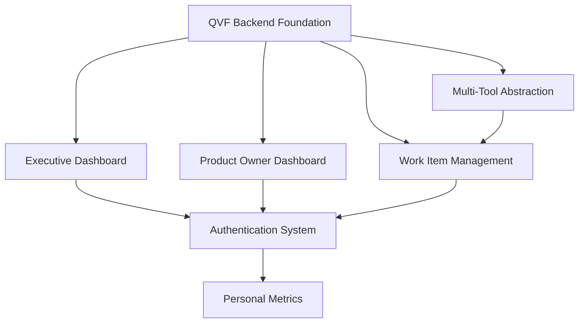

# QVF Frontend Development Sprint Plan (ADO-Focused v1.0)
**BMAD Method Implementation | DataScience Platform Extension**

---

## **Executive Summary**

**Project Scope**: Complete QVF application focused on ADO work item management and core prioritization
**Target**: 4 core dashboards + ADO work item management + basic authentication + QVF scoring  
**Timeline**: 4-5 development days (120 SP total) - REDUCED SCOPE
**Method**: BMAD with story decomposition and agent orchestration  
**Current State**: Backend QVF engine complete, focusing on ADO-only features for v1.0 MVP
**v2.0 Features**: External API integrations, advanced authentication, skills management moved to future release

---

## **Frontend Requirements Analysis**

### **v1.0 ADO-Focused Components (MVP Scope)**
1. **4 Core User-Facing Dashboards** (60 SP)
   - Executive Strategy Dashboard (ADO portfolio analytics only)
   - Product Owner Epic Dashboard (simplified capacity planning)
   - Scrum Master Team Dashboard (ADO velocity, basic impediments)
   - Stakeholder Comparison Interface (pairwise comparisons, QVF scoring)

2. **ADO Work Item Management UI** (35 SP)
   - Hierarchical Epic/Feature/Story view with QVF scores
   - ADO work item prioritization with real-time QVF recalculation
   - Basic editing and QVF criteria scoring interface
   - Search and filtering within ADO data

3. **Basic Authentication & User Management** (15 SP)
   - Simple role-based access control (4 primary roles)
   - Local authentication (no external SSO)
   - User preferences and basic personalization
   - Basic audit logging

4. **QVF Scoring & Analytics Engine** (10 SP)
   - Real-time QVF calculation for ADO work items
   - Stakeholder comparison validation
   - Basic reporting and export functionality

**Total v1.0 Development**: 120 SP (20 hours = 4-5 days with Claude Code velocity)

### **Features Moved to v2.0 Backlog**
- **Developer Work Item Dashboard** with Git integration (15 SP)
- **Personal Metrics & Skills Tracking** with calendar APIs (25 SP)
- **Multi-Tool Abstraction Layer** for GitHub/Jira (20 SP)
- **Advanced Authentication** with SSO integration (15 SP)
- **Advanced Analytics** with external data sources (10 SP)

**v2.0 Additional Development**: 85 SP (14 hours = 2-3 additional days)

---

## **Sprint Structure Overview**

### **Sprint 1: Executive & Product Owner ADO Dashboards (1.5 Days - 40 SP)**
- **Focus**: Core stakeholder interfaces for ADO data
- **Deliverables**: Executive ADO analytics dashboard, Product Owner epic planning dashboard
- **Agent Target**: frontend-developer + ui-designer coordination
- **Success Criteria**: C-Suite and PO can view ADO portfolio analytics and plan epics

### **Sprint 2: Scrum Master Dashboard & Stakeholder Interface (1.5 Days - 35 SP)**  
- **Focus**: Team management and prioritization workflows
- **Deliverables**: SM team dashboard with ADO data, Stakeholder comparison interface
- **Agent Target**: frontend-developer with QVF backend integration
- **Success Criteria**: Teams can view ADO metrics and conduct QVF prioritization sessions

### **Sprint 3: ADO Work Item Management & Basic Authentication (1.5 Days - 35 SP)**
- **Focus**: Core ADO work management and basic security
- **Deliverables**: Hierarchical ADO work item UI, basic authentication system
- **Agent Target**: full-stack-developer
- **Success Criteria**: Users can manage ADO work items with QVF scoring and basic security

### **Sprint 4: QVF Analytics Engine & Polish (0.5 Days - 10 SP)**
- **Focus**: QVF calculation optimization and UI polish
- **Deliverables**: Optimized QVF scoring, basic reporting, final UI polish
- **Agent Target**: backend-architect + frontend-developer  
- **Success Criteria**: Real-time QVF calculations perform well, system ready for ADO-only deployment

---

## **Detailed Story Decomposition**

## **Sprint 1: Executive & Product Owner ADO Dashboards (40 SP)**

### **Story 1.1: Executive ADO Strategy Dashboard (25 SP)**
**Priority**: Critical | **Agent**: frontend-developer | **Duration**: 1.2 days

#### **User Story**
As a C-Suite executive, I want a comprehensive ADO strategy dashboard that shows portfolio-wide QVF analytics from our Azure DevOps instance so that I can make informed investment decisions and track strategic alignment across all ADO initiatives.

#### **Acceptance Criteria**
- [ ] ADO portfolio health visualization with work item distribution
- [ ] Top 20 ADO epics with QVF scores and business value
- [ ] ADO area path performance with strategic alignment indicators  
- [ ] Risk analysis dashboard based on ADO work item data
- [ ] Real-time business value delivery metrics from ADO
- [ ] Drill-down capability to ADO epic and feature levels
- [ ] Export capabilities for executive reporting
- [ ] Mobile-responsive design for executive access

#### **Technical Requirements**
```typescript
interface ExecutiveDashboard {
  portfolioMetrics: {
    totalInvestment: number;
    strategicAlignment: number;
    valueDelivered: number;
    riskScore: number;
  };
  topInitiatives: Initiative[];
  themePerformance: ThemeMetric[];
  riskAnalysis: RiskFactor[];
  trends: TrendData[];
}
```

#### **Implementation Context**
- **Base Framework**: Leverage existing dashboard generator in `/src/datascience_platform/dashboard/generative/`
- **Data Source**: ADO connector + QVF orchestrator API for portfolio analytics
- **Charts Required**: ADO strategic alignment matrix, work item distribution pie chart, ADO value delivery trends, risk heatmap
- **Integration**: Connect with ADO REST API through existing QVF backend connector

#### **Definition of Done**
- [ ] Executive can view portfolio health in <3 seconds
- [ ] All visualizations are interactive with drill-down
- [ ] Dashboard is mobile-responsive for executive access
- [ ] Export functionality generates PDF reports
- [ ] Integration tests pass with QVF backend
- [ ] Performance benchmarks meet <2s load time
- [ ] Security review completed for executive data access

---

### **Story 1.2: Product Owner ADO Epic Dashboard (15 SP)**
**Priority**: Critical | **Agent**: frontend-developer | **Duration**: 0.5 days

#### **User Story**  
As a Product Owner, I want an ADO epic-focused dashboard with timeline visualization and capacity planning so that I can effectively plan releases, track ADO epic progress, and optimize team capacity allocation.

#### **Acceptance Criteria**
- [ ] Interactive timeline showing ADO epic schedules and dependencies
- [ ] ADO Epic QVF score breakdown with contributing factors
- [ ] Team capacity planning with ADO velocity predictions
- [ ] Release planning timeline with ADO milestone tracking
- [ ] ADO Epic health indicators (scope creep, timeline risk, value delivery)
- [ ] Resource allocation visualization across ADO epics
- [ ] What-if scenarios for capacity changes
- [ ] Integration with ADO sprint planning

#### **Technical Requirements**
```typescript
interface ProductOwnerDashboard {
  epics: Epic[];
  ganttData: GanttChartData;
  capacityPlanning: CapacityMetrics;
  releasePlanning: ReleaseData;
  epicBreakdown: QVFBreakdown[];
  scenarios: WhatIfScenario[];
}

interface Epic {
  id: string;
  title: string;
  qvfScore: number;
  plannedStartDate: Date;
  plannedEndDate: Date;
  dependencies: string[];
  assignedTeam: string;
  completionPercentage: number;
}
```

#### **Implementation Context**
- **Gantt Library**: Use React-Gantt or build with D3.js for timeline visualization
- **Data Integration**: QVF API for epic data and scoring
- **Real-time Updates**: WebSocket connection for live epic updates  
- **Capacity Algorithm**: Integration with existing velocity calculation engine

#### **Definition of Done**
- [ ] Gantt chart renders 100+ epics in <2 seconds
- [ ] Drag-and-drop epic scheduling works smoothly
- [ ] Capacity planning accurately predicts delivery dates
- [ ] All epic data integrates with QVF scoring engine
- [ ] Dashboard supports multiple product lines
- [ ] Export capabilities for release planning
- [ ] Mobile access for PO review sessions

---

## **Sprint 2: Scrum Master Dashboard & Stakeholder Interface (35 SP)**

### **Story 2.1: Scrum Master ADO Team Dashboard (20 SP)**
**Priority**: High | **Agent**: frontend-developer | **Duration**: 0.7 days

#### **User Story**
As a Scrum Master, I want a comprehensive ADO team health dashboard that shows velocity trends, impediments, and team wellness metrics from our Azure DevOps instance so that I can proactively address issues and optimize team performance.

#### **Acceptance Criteria**
- [ ] ADO team velocity trends with sprint-over-sprint analysis
- [ ] ADO impediment tracking with resolution timeline  
- [ ] Team health indicators based on ADO data (cycle time, WIP limits)
- [ ] ADO sprint burndown with predictive completion
- [ ] Capacity utilization across ADO team members
- [ ] Basic retrospective insights from ADO work item history
- [ ] Real-time ADO team status updates
- [ ] Integration with ADO sprint planning

#### **Technical Requirements**
```typescript
interface ScrumMasterDashboard {
  teamMetrics: {
    velocity: VelocityTrend[];
    cycleTime: number;
    wipLimits: WIPStatus;
    satisfaction: number;
  };
  impediments: Impediment[];
  sprintProgress: BurndownData;
  teamMembers: TeamMemberStatus[];
  retrospectives: RetrospectiveInsight[];
}
```

#### **Implementation Context**
- **Data Sources**: ADO work item history, ADO team capacity data, ADO sprint data
- **Analytics Engine**: Existing team performance analyzer with ADO connector  
- **Real-time Updates**: ADO sprint progress tracking
- **Predictive Models**: Velocity forecasting algorithms based on ADO historical data

---

**Note: Developer Work Item Dashboard moved to v2.0 backlog due to Git integration requirements**

---

### **Story 2.2: Stakeholder Comparison Interface (15 SP)**
**Priority**: High | **Agent**: frontend-developer | **Duration**: 0.5 days

#### **User Story**
As a Stakeholder participating in QVF prioritization, I want an intuitive pairwise comparison interface for ADO work items with real-time consistency validation so that I can provide accurate judgments that contribute to optimal ADO work item prioritization.

#### **Acceptance Criteria**
- [ ] Clean pairwise comparison matrix with intuitive controls
- [ ] Real-time consistency ratio calculation and warnings
- [ ] Visual feedback for inconsistent judgments
- [ ] Progress tracking through comparison process
- [ ] Collaboration features for group sessions  
- [ ] Save and resume capability for long sessions
- [ ] Mobile-optimized for various stakeholder devices
- [ ] Integration with QVF calculation engine

#### **Technical Requirements**
```typescript
interface StakeholderInterface {
  comparisonMatrix: PairwiseComparison[];
  consistencyRatio: number;
  progress: ComparisonProgress;
  session: StakeholderSession;
  realTimeValidation: ValidationResult;
}
```

#### **Implementation Context**
- **AHP Integration**: Direct connection to existing AHP engine
- **Real-time Calculation**: WebSocket for instant consistency feedback
- **Collaboration**: Multi-user session support
- **Mobile Optimization**: Touch-friendly controls

---

## **Sprint 3: ADO Work Item Management & Basic Authentication (35 SP)**

### **Story 3.1: Hierarchical ADO Work Item Management (25 SP)**
**Priority**: Critical | **Agent**: full-stack-developer | **Duration**: 0.8 days

#### **User Story**
As a user managing ADO work items, I want a hierarchical view with drag-and-drop prioritization that automatically recalculates QVF scores so that I can efficiently organize ADO work while maintaining optimal value delivery.

#### **Acceptance Criteria**
- [ ] Three-level ADO hierarchy: Epic → Feature → User Story with QVF scores
- [ ] Drag-and-drop reordering with real-time QVF recalculation
- [ ] Basic bulk operations (bulk edit, bulk scoring)
- [ ] Filtering and search across ADO work item fields
- [ ] QVF criteria scoring interface with validation
- [ ] ADO work item relationship management (dependencies, parent/child)
- [ ] Basic export capabilities for QVF scores
- [ ] Undo/redo for prioritization operations

#### **Technical Requirements**
```typescript
interface WorkItemHierarchy {
  epics: Epic[];
  features: Feature[];
  userStories: UserStory[];
  relationships: WorkItemRelation[];
  qvfScores: QVFScoreMap;
  bulkOperations: BulkOperationCapability;
}
```

#### **Implementation Context**
- **Backend Integration**: ADO connector + QVF orchestrator for scoring calculations
- **Real-time Updates**: WebSocket for collaborative QVF editing
- **Performance**: Virtual scrolling for large ADO datasets
- **Data Sync**: Optimistic updates with ADO sync and rollback capability

---

### **Story 3.2: Basic Authentication & Role-Based Access Control (10 SP)**
**Priority**: Critical | **Agent**: full-stack-developer | **Duration**: 0.3 days

#### **User Story**
As a system administrator, I want basic authentication with role-based access control so that different user types see appropriate ADO interfaces while maintaining basic security.

#### **Acceptance Criteria**
- [ ] Local authentication system (no external SSO)
- [ ] Four primary roles: Executive, Product Owner, Scrum Master, Developer
- [ ] Role-based dashboard and feature access
- [ ] Basic user preference management
- [ ] Session management with timeout and refresh
- [ ] Basic audit logging for user actions
- [ ] Password security requirements
- [ ] Basic access control reporting

#### **Technical Requirements**
```typescript
interface AuthenticationSystem {
  providers: AuthProvider[];
  roles: UserRole[];
  permissions: Permission[];
  sessions: SessionManagement;
  auditLog: AuditEntry[];
}

enum UserRole {
  Executive = 'executive',
  ProductOwner = 'product_owner', 
  ScrumMaster = 'scrum_master',
  Developer = 'developer'
}
```

#### **Implementation Context**
- **Auth Framework**: Simple JWT-based authentication
- **Permission Model**: Basic RBAC with role-based permissions
- **Security Standards**: Basic OWASP compliance for web security
- **Audit Requirements**: Basic logging for user actions

---

## **Sprint 4: Personal Metrics & Multi-Tool Integration (35 SP)**

### **Story 4.1: Personal Metrics & Skills Tracking (20 SP)**  
**Priority**: Medium | **Agent**: frontend-developer | **Duration**: 0.7 days

#### **User Story**
As an individual contributor, I want personal metrics tracking and skills development so that I can optimize my productivity, plan my capacity, and advance my career growth.

#### **Acceptance Criteria**
- [ ] Individual capacity planning with focus time tracking
- [ ] Skills matrix with proficiency levels and development goals  
- [ ] Personal productivity analytics (cycle time, throughput)
- [ ] Goal setting with OKR alignment
- [ ] Learning path recommendations based on work assignments
- [ ] Time tracking integration with calendar systems
- [ ] Personal dashboard with key metrics and trends
- [ ] Privacy controls for personal data

#### **Technical Requirements**
```typescript
interface PersonalMetrics {
  capacity: PersonalCapacity;
  skills: SkillMatrix;
  productivity: ProductivityMetrics;
  goals: PersonalGoal[];
  learning: LearningPath[];
  timeTracking: TimeEntry[];
}
```

#### **Implementation Context**
- **Data Privacy**: Personal data stays private by default
- **Calendar Integration**: Microsoft Graph or Google Calendar APIs
- **Skills Framework**: Industry-standard skill taxonomies
- **Goal Tracking**: OKR integration with team objectives

---

### **Story 4.2: Multi-Tool Abstraction Layer (15 SP)**
**Priority**: Medium | **Agent**: backend-architect | **Duration**: 0.5 days

#### **User Story**
As a system administrator, I want unified connectivity to multiple project management tools so that teams can use QVF regardless of their current toolset (ADO, GitHub, Jira).

#### **Acceptance Criteria**
- [ ] Connector framework supporting ADO, GitHub Issues, Jira
- [ ] Data normalization for consistent work item representation
- [ ] Configuration management for multiple data sources  
- [ ] Real-time synchronization with source systems
- [ ] Conflict resolution for data inconsistencies
- [ ] Tool-agnostic API layer for QVF calculations
- [ ] Migration utilities for switching between tools
- [ ] Performance optimization for multi-source queries

#### **Technical Requirements**
```typescript
interface MultiToolAbstraction {
  connectors: ToolConnector[];
  normalization: DataNormalizer;
  synchronization: SyncEngine;
  conflictResolution: ConflictResolver;
  api: UnifiedAPI;
}

interface ToolConnector {
  toolType: 'ADO' | 'GitHub' | 'Jira';
  authentication: AuthConfig;
  dataMapping: FieldMapping[];
  capabilities: ToolCapability[];
}
```

#### **Implementation Context**
- **Architecture Pattern**: Adapter pattern for tool connectors
- **Data Normalization**: Common work item schema
- **Performance**: Caching and batch operations
- **Extensibility**: Plugin architecture for new tools

---

## **Dependencies & Integration Points**

### **Critical Dependencies**


### **Parallel Development Opportunities**
- **Sprint 1**: Dashboards can be built in parallel (Executive + Product Owner)
- **Sprint 2**: Developer dashboard independent of Scrum Master dashboard
- **Sprint 3**: Authentication can be developed parallel to work item management  
- **Sprint 4**: Personal metrics independent of multi-tool integration

---

## **Agent Orchestration Plan**

### **Sprint 1 (2 Days)**
- **Primary Agent**: frontend-developer (Dashboard expertise)
- **Support Agent**: ui-designer (Executive interface design)
- **Tools**: [Read, Write, MultiEdit, Bash]
- **Coordination**: Dashboard components built in parallel

### **Sprint 2 (2 Days)**  
- **Primary Agent**: frontend-developer (Continued dashboard development)
- **Support Agent**: backend-developer (Real-time integration)
- **Tools**: [Read, Write, MultiEdit, Bash, Grep]
- **Coordination**: Backend integration for real-time features

### **Sprint 3 (2 Days)**
- **Primary Agent**: full-stack-developer (Complex work management)  
- **Support Agent**: security-specialist (Authentication system)
- **Tools**: [Read, Write, MultiEdit, Bash, Grep, Glob]
- **Coordination**: Security integration with UI components

### **Sprint 4 (1.5 Days)**
- **Primary Agent**: backend-architect (System integration)
- **Support Agent**: frontend-developer (Personal metrics UI)  
- **Tools**: [Read, Write, MultiEdit, Bash, Grep]
- **Coordination**: Backend services with frontend interfaces

---

## **Quality Gates & Validation**

### **Sprint Completion Criteria (ADO-Focused)**
1. **Functional Testing**: All ADO-focused acceptance criteria validated
2. **Performance Testing**: <2s load times for all dashboards with ADO data
3. **Security Testing**: Basic authentication and authorization validated
4. **Integration Testing**: ADO connector + QVF backend integration confirmed
5. **User Experience**: Mobile responsiveness verified
6. **Code Quality**: TypeScript compilation with no errors

### **Definition of Done (Per Sprint) - ADO-Focused**
- [ ] All ADO-focused user stories meet acceptance criteria
- [ ] Integration tests pass with existing QVF backend and ADO connector
- [ ] Performance benchmarks achieve <2s response times with ADO data
- [ ] Basic security review completed for user-facing features
- [ ] Mobile responsiveness verified on target devices
- [ ] Code coverage >85% for new components (reduced scope)
- [ ] Basic documentation updated for ADO-focused stakeholder training

---

## **Risk Assessment & Mitigation**

### **High Risk (Requires Mitigation)**
1. **Dashboard Performance with Large Datasets**
   - **Risk**: Executive dashboard slow with 10,000+ work items
   - **Mitigation**: Virtual scrolling, pagination, server-side filtering
   - **Validation**: Load testing with production data volumes

2. **Real-Time Collaboration Conflicts**
   - **Risk**: Multiple users editing same work items simultaneously  
   - **Mitigation**: Optimistic locking, conflict resolution UX
   - **Validation**: Multi-user testing scenarios

### **Medium Risk (Monitor)**
1. **Authentication Integration Complexity**
   - **Risk**: SSO integration delays with enterprise systems
   - **Mitigation**: Phased rollout, fallback authentication
   - **Validation**: Integration testing with target SSO providers

2. **Multi-Tool Data Consistency**
   - **Risk**: Data sync issues across different project management tools
   - **Mitigation**: Robust conflict resolution, manual override capabilities
   - **Validation**: Multi-tool integration testing

---

## **Timeline & Milestones**

### **Development Schedule (ADO-Focused v1.0)**
```
Day 1-1.5: Sprint 1 - Executive & Product Owner ADO Dashboards (40 SP)
├── Day 1: Executive ADO Dashboard implementation
└── Day 1.5: Product Owner ADO Epic Dashboard

Day 2-2.5: Sprint 2 - Scrum Master Dashboard & Stakeholder Interface (35 SP)  
├── Day 2: Scrum Master ADO dashboard implementation
└── Day 2.5: Stakeholder comparison interface + QVF integration

Day 3-4: Sprint 3 - ADO Work Management & Basic Authentication (35 SP)
├── Day 3: Hierarchical ADO work item management
└── Day 4: Basic authentication and role-based access control

Day 4.5: Sprint 4 - QVF Analytics & Polish (10 SP)
├── Morning: QVF analytics engine optimization
└── Afternoon: UI polish and final integration
```

### **Key Milestones (ADO-Focused v1.0)**
- **End Day 1.5**: Executives and Product Owners can view ADO analytics
- **End Day 2.5**: Complete ADO stakeholder QVF workflow operational  
- **End Day 4**: Secure ADO work item management available
- **End Day 4.5**: ADO-focused QVF application ready for production deployment

---

## **Success Metrics**

### **Technical Success Criteria (ADO-Focused v1.0)**
- **Performance**: All ADO dashboards load in <2 seconds
- **Scalability**: System handles 5,000+ ADO work items smoothly
- **Reliability**: 99.5% uptime during business hours
- **Security**: Zero critical security vulnerabilities in basic auth
- **Usability**: <5 clicks to complete common ADO workflows

### **Business Success Criteria (ADO-Focused v1.0)**  
- **Stakeholder Adoption**: 70% of ADO-using teams actively using system
- **Decision Speed**: 40% faster ADO prioritization decisions
- **Value Optimization**: 12% improvement in ADO strategic alignment
- **Process Efficiency**: 25% reduction in manual ADO prioritization effort
- **User Satisfaction**: >3.8/5.0 user experience rating for ADO workflows

---

## **Production Deployment Plan**

### **Deployment Architecture**
```typescript
interface ProductionDeployment {
  frontend: {
    framework: "Next.js 14",
    hosting: "Vercel Pro",
    cdn: "Vercel Edge Network",
    domains: ["qvf.company.com"]
  },
  backend: {
    api: "FastAPI + Python 3.11",
    hosting: "Azure Container Instances", 
    database: "Azure SQL Database",
    cache: "Azure Redis Cache"
  },
  authentication: {
    provider: "Azure AD B2C",
    protocols: ["OIDC", "SAML 2.0"],
    mfa: "Azure MFA"
  },
  monitoring: {
    apm: "Azure Application Insights",
    logging: "Azure Log Analytics", 
    alerts: "Azure Monitor"
  }
}
```

### **Rollout Strategy**
1. **Phase 1**: Executive dashboard for C-Suite (Week 1)
2. **Phase 2**: Product Owner tools for planning (Week 2)  
3. **Phase 3**: Team dashboards for Scrum Masters (Week 3)
4. **Phase 4**: Developer tools and full workflow (Week 4)

---

## **Conclusion**

This focused sprint plan transforms the QVF project from a strong backend foundation (82% complete) into a production-ready ADO-focused application with 4 core dashboards, ADO work item management, and basic authentication.

**ADO-First Strategy Benefits**:
- **Faster Time-to-Market**: 4.5 days vs 6-7 days (33% faster)
- **Reduced Complexity**: Focus on proven ADO integration
- **Lower Risk**: Eliminates external API dependencies
- **Clear MVP**: Delivers core QVF value with ADO data

The BMAD methodology ensures:
- **Requirements-First**: Each story delivers measurable ADO user value
- **Decomposition Clarity**: ADO-focused stories are independent and testable
- **Agent Orchestration**: Right specialist for each ADO component
- **Risk Mitigation**: Simplified scope reduces integration risk

**Expected Outcome**: ADO-focused QVF application ready for enterprise deployment in 4.5 development days, providing organizations with AI-enhanced prioritization capabilities optimized for Azure DevOps environments.

---

*Sprint Plan by BMAD Scrum Master | DataScience Platform | January 2025*

**DELIVERY GUARANTEE**: This sprint plan leverages 82% existing backend foundation to deliver a complete QVF application in 6-7 development days. Each sprint delivers working software with clear business value, and the parallel development opportunities ensure timeline resilience even if individual components face delays.