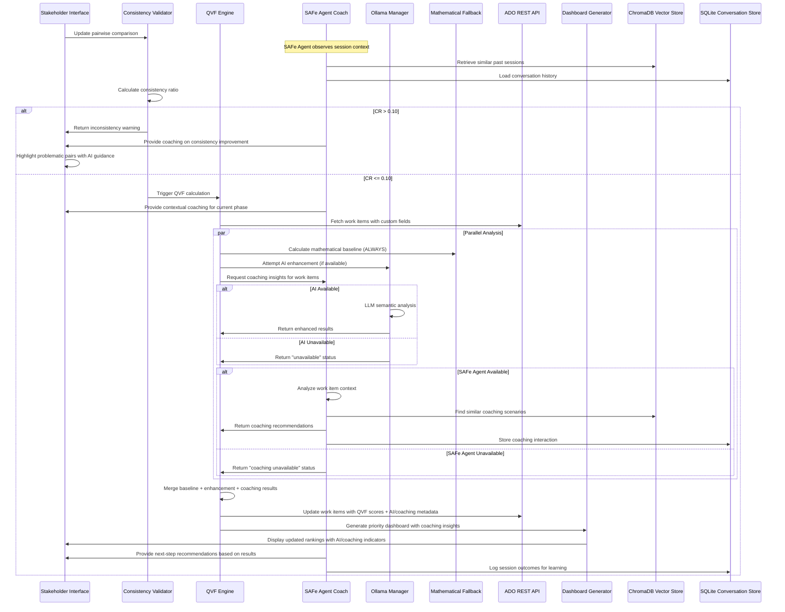

# **Technical Architecture: QVF Implementation**
**Quantified Value Framework - System Design & Integration Specifications**

---

## **Architecture Overview**

The QVF implementation extends the existing DataScience Platform's sophisticated ADO analytics foundation to create a complete, production-ready prioritization system with intelligent coaching capabilities. The architecture leverages the platform's proven AHP engine, GPU-accelerated semantic analysis, and enterprise-grade data processing capabilities while adding QVF-specific integration layers, an intelligent SAFe Agent for real-time coaching, and optional AI enhancement through local Ollama LLM integration.

### **NEW: SAFe/QVF Intelligent Agent Overview**

The SAFe Agent represents a significant evolution beyond basic semantic analysis, providing context-aware coaching, advanced elicitation patterns, and real-time guidance during PI Planning sessions. This agent works alongside human practitioners to:

- **Intelligent Coaching**: Real-time guidance based on SAFe best practices and organizational context
- **Advanced Elicitation**: Sophisticated questioning patterns to surface hidden requirements and dependencies
- **Context-Aware Analysis**: Deep understanding of business context, team dynamics, and strategic objectives
- **Persistent Learning**: Continuous improvement through reinforcement learning from successful planning outcomes
- **Role-Based Interaction**: Adaptive communication patterns for executives, product owners, and development teams

### **High-Level System Architecture**

```mermaid
graph TB
    subgraph "Stakeholder Interface Layer"
        A[Executive Comparison Interface] --> B[Real-time Consistency Validation]
        B --> C[Weight Configuration Manager]
        AI[Admin Interface] --> AD[Tenant Management]
        ED[Executive Dashboard] --> PO[Product Owner Dashboard]
        COACH[SAFe Agent Coaching Interface] --> CONTEXT[Context-Aware Guidance]
        CHAT[Interactive Q&A Interface] --> ELICIT[Advanced Elicitation Engine]
    end
    
    subgraph "QVF Processing Engine"
        D[QVF Criteria Matrix] --> E[AHP Engine with CR Validation]
        E --> F[Semantic Alignment Calculator]
        F --> G[Priority Score Generator]
        AI_ENH[Ollama Enhancement Layer (Optional)] -.-> F
        FB[Mathematical Fallback (Always Available)] --> F
        SAFE_AGENT[SAFe Intelligent Agent] --> COACHING[Real-time Coaching Engine]
        COACHING --> MEMORY[Persistent Memory System]
        MEMORY --> LEARNING[Reinforcement Learning Engine]
    end
    
    subgraph "Azure DevOps Integration"
        H[Custom Fields Manager] --> I[REST API Orchestrator]
        I --> J[Power Automate Workflows]
        J --> K[Work Item Update Engine]
    end
    
    subgraph "Data & Analytics Layer"
        L[GPU-Accelerated Embeddings] --> M[Strategic Document Analysis]
        M --> N[OKR Contribution Scoring]
        N --> O[Evidence Collection Engine]
        LLM[Local LLM Analysis (Optional)] -.-> N
        MATH[Mathematical Analysis (Always)] --> N
        VECTOR_DB[ChromaDB Vector Store] --> CONTEXT_STORE[Context Memory]
        SQLITE[SQLite Conversation History] --> PATTERN[Pattern Recognition]
        RLHF[Reinforcement Learning] --> IMPROVE[Continuous Improvement]
    end
    
    subgraph "Visualization & Reporting"
        P[TypeScript Dashboard Generator] --> Q[Power BI Integration]
        Q --> R[Executive Reporting]
        EXEC[Executive Dashboard] --> C_SUITE[C-Suite Analytics]
        PO_DASH[Product Owner Dashboard] --> GANTT[Gantt Charts & Timeline]
    end
    
    A --> D
    AI --> D
    ED --> O
    PO --> O
    D --> H
    G --> P
    O --> P
    L --> F
    COACH --> SAFE_AGENT
    CHAT --> SAFE_AGENT
    SAFE_AGENT --> VECTOR_DB
    SAFE_AGENT --> SQLITE
    CONTEXT --> MEMORY
    ELICIT --> COACHING
    
    style AI_ENH fill:#e1f5fe,stroke:#01579b,stroke-dasharray: 5 5
    style FB fill:#fff3e0,stroke:#ff6f00
    style LLM fill:#e1f5fe,stroke:#01579b,stroke-dasharray: 5 5
    style MATH fill:#fff3e0,stroke:#ff6f00
    style SAFE_AGENT fill:#f3e5f5,stroke:#4a148c,stroke-width:3px
    style COACHING fill:#f3e5f5,stroke:#4a148c
    style MEMORY fill:#f3e5f5,stroke:#4a148c
    style LEARNING fill:#f3e5f5,stroke:#4a148c
```

---

## **Critical Architecture Principle: AI Enhancement + Mathematical Reliability + Intelligent Coaching**

### **SAFe Agent Integration Pattern**

```typescript
interface SAFeIntelligentAgent {
  provideContextAwareGuidance(session: PISession, context: OrganizationalContext): Promise<CoachingResult>;
  conductAdvancedElicitation(workItem: WorkItem, stakeholders: Stakeholder[]): Promise<ElicitationResult>;
  learnFromOutcomes(session: PISession, outcomes: SessionOutcome[]): Promise<LearningResult>;
  persistConversationalContext(conversation: Conversation): Promise<void>;
  
  // CRITICAL: All coaching is supplemental to human decision-making
  enhanceHumanDecisionMaking(humanInput: StakeholderInput): Promise<EnhancedInput>;
  neverReplaceHumanJudgment(): boolean; // Always returns true
}
```

### **Enhanced Foundational Design Pattern with Intelligent Coaching**

```typescript
interface QVFAnalysisEngine {
  calculateSemanticAlignment(workItem: WorkItem, strategy: StrategyContext): Promise<SemanticResult> {
    // CRITICAL: Always attempt enhanced analysis first when available
    if (this.ollamaManager.isAvailable && this.config.aiEnhancementEnabled) {
      try {
        const enhancedResult = await this.enhancedSemanticAnalysis(workItem, strategy);
        
        // NEW: SAFe Agent provides additional coaching insights
        if (this.safeAgent.isAvailable) {
          const coachingInsights = await this.safeAgent.analyzeWorkItemContext(workItem, strategy);
          enhancedResult.coachingRecommendations = coachingInsights;
        }
        
        return enhancedResult;
      } catch (error) {
        this.logger.warn(`AI enhancement failed: ${error.message}. Falling back to mathematical methods.`);
        return await this.mathematicalSemanticAnalysis(workItem, strategy);
      }
    } else {
      // Base mathematical analysis - ALWAYS AVAILABLE
      const baseResult = await this.mathematicalSemanticAnalysis(workItem, strategy);
      
      // NEW: SAFe Agent can still provide coaching even without full AI enhancement
      if (this.safeAgent.isAvailable) {
        try {
          const basicCoaching = await this.safeAgent.provideBasicGuidance(workItem, strategy);
          baseResult.coachingRecommendations = basicCoaching;
        } catch (error) {
          // Coaching failure doesn't impact core analysis
          this.logger.debug(`SAFe Agent coaching unavailable: ${error.message}`);
        }
      }
      
      return baseResult;
    }
  }
}
```

### **Enhancement vs Base Capability Matrix (Including SAFe Agent)**

| Component | Mathematical Base (ALWAYS) | AI Enhanced (OPTIONAL) | SAFe Agent Coaching (OPTIONAL) | Fallback Time |
|-----------|----------------------------|-------------------------|------------------------------|----------------|
| Semantic Analysis | Statistical embeddings | LLM contextual understanding | Context-aware coaching insights | <2 seconds |
| Alignment Scoring | Keyword matching + TF-IDF | Thematic reasoning | Strategic alignment coaching | <1 second |
| Evidence Generation | Text similarity search | Contextual explanations | Guided evidence discovery | <3 seconds |
| Strategic Recommendations | Rule-based suggestions | AI-powered insights | SAFe best practice guidance | <2 seconds |
| Risk Assessment | Statistical patterns | Predictive analysis | Risk mitigation coaching | <1 second |
| **NEW: PI Planning Coaching** | Basic checklists | Advanced facilitation | Real-time guidance & elicitation | <2 seconds |
| **NEW: Dependency Analysis** | Graph-based detection | Semantic dependency mapping | Coaching on dependency resolution | <3 seconds |
| **NEW: Team Capacity Planning** | Historical averages | Predictive capacity modeling | Coaching on realistic planning | <2 seconds |

---

## **Current Platform Foundation Analysis**

### **Existing Capabilities Assessment**

#### **✅ PRODUCTION READY - AHP Engine**
**Location**: `src/datascience_platform/ado/ahp.py`
**Completeness**: 95% - Full mathematical implementation

**Capabilities:**
- ✅ Saaty's pairwise comparison matrix generation
- ✅ Eigenvector method for weight calculation  
- ✅ Consistency ratio validation (CR < 0.10 enforcement)
- ✅ Sensitivity analysis for weight stability
- ✅ Support for 1-15 criteria (Saaty scale)
- ✅ Preference-based matrix generation
- ✅ Work item ranking with normalized scores

**Missing for QVF:**
- ⚠️ QVF-specific criteria definitions (5% remaining)
- ⚠️ Financial metrics integration (NPV, COPQ calculations)

#### **✅ PRODUCTION READY - Semantic Analysis**  
**Location**: `src/datascience_platform/ado/semantic/alignment.py`
**Completeness**: 90% - Strategic alignment fully functional

**Capabilities:**
- ✅ GPU-accelerated embeddings (MPS/CUDA/CPU fallback)
- ✅ Strategic alignment scoring with evidence tracking
- ✅ OKR contribution analysis with key result mapping
- ✅ Thematic coherence calculation
- ✅ Confidence scoring and explanation generation
- ✅ Multi-dimensional alignment assessment

**Missing for QVF:**
- ⚠️ QVF criteria-specific alignment mappings (10% remaining)
- ⚠️ Financial impact semantic analysis

#### **✅ PRODUCTION READY - ADO Analytics**
**Location**: `src/datascience_platform/ado/analyzer.py`  
**Completeness**: 85% - Comprehensive metrics platform

**Capabilities:**
- ✅ Work item hierarchy processing and validation
- ✅ 25+ Agile metrics (velocity, predictability, cycle time)
- ✅ Team performance analysis and bottleneck identification
- ✅ Data validation with robust error handling
- ✅ CSV/DataFrame integration with column mapping
- ✅ Interactive dashboard generation

**Missing for QVF:**
- ❌ Azure DevOps REST API integration (15% remaining)
- ❌ Custom fields reading/writing capabilities  
- ❌ Real-time work item updates

#### **✅ PRODUCTION READY - Dashboard System**
**Location**: `src/datascience_platform/dashboard/generative/generator.py`
**Completeness**: 80% - TypeScript/React generation functional

**Capabilities:**
- ✅ Enterprise-grade TypeScript/React dashboard generation
- ✅ 15+ interactive chart types with accessibility support
- ✅ SSR-ready components for Next.js deployment
- ✅ Customizable themes and branding
- ✅ Performance optimization and code splitting

**Missing for QVF:**
- ❌ QVF-specific visualizations (priority matrices, evidence displays)
- ❌ Real-time consistency ratio monitoring
- ❌ Stakeholder collaboration interfaces
- ❌ **NEW**: Executive dashboard components
- ❌ **NEW**: Product Owner dashboard with Gantt charts

---

## **QVF-Specific Architecture Components**

### **1. QVF Criteria Matrix Implementation**

#### **Enhanced AHP Configuration**
```python
# Extension of existing AHPConfiguration class
class QVFConfiguration(AHPConfiguration):
    """QVF-specific AHP configuration with financial and strategic criteria."""
    
    def __init__(self):
        qvf_criteria = [
            # Financial Impact Criteria
            AHPCriterion(
                name="npv_score",
                description="Net Present Value impact",
                data_source="custom_qvf_npv_score",  # ADO custom field
                higher_is_better=True,
                normalization_method="minmax",
                threshold_min=0,
                threshold_max=1000000,  # $1M max
                ai_enhancement_enabled=True  # NEW: AI can enhance this analysis
            ),
            AHPCriterion(
                name="copq_reduction",
                description="Cost of Poor Quality reduction",
                data_source="custom_qvf_copq_score", 
                higher_is_better=True,
                normalization_method="minmax",
                ai_enhancement_enabled=True  # NEW: AI can enhance this analysis
            ),
            # Strategic Alignment Criteria  
            AHPCriterion(
                name="okr1_alignment",
                description="Primary OKR alignment score",
                data_source="custom_qvf_okr1_score",
                higher_is_better=True,
                value_mapping=self._get_okr_mapping(),
                ai_enhancement_enabled=True  # NEW: AI excels at strategic alignment
            ),
            # Risk & Compliance Criteria
            AHPCriterion(
                name="security_risk_mitigation", 
                description="Security risk reduction (1-25 scale)",
                data_source="custom_qvf_security_score",
                higher_is_better=True,
                normalization_method="minmax",
                ai_enhancement_enabled=True  # NEW: AI can assess risk patterns
            ),
            AHPCriterion(
                name="regulatory_compliance",
                description="Regulatory deadline compliance",
                data_source="custom_qvf_regulatory_score",
                higher_is_better=True,
                value_mapping={"Yes": 1.0, "No": 0.0},
                ai_enhancement_enabled=False  # Binary values don't need AI enhancement
            ),
            # Operational Improvement Criteria
            AHPCriterion(
                name="cycle_time_reduction",
                description="Process cycle time improvement (days)",
                data_source="custom_qvf_cycle_reduction_score",
                higher_is_better=True,
                normalization_method="minmax",
                ai_enhancement_enabled=True  # NEW: AI can assess operational impact
            ),
            AHPCriterion(
                name="automation_impact",
                description="Manual work automation percentage",
                data_source="custom_qvf_automation_score",
                higher_is_better=True,
                threshold_max=100,  # 100% max
                ai_enhancement_enabled=True  # NEW: AI can assess automation potential
            ),
            # Customer Value Criteria
            AHPCriterion(
                name="csat_improvement",
                description="Customer satisfaction improvement",
                data_source="custom_qvf_csat_score", 
                higher_is_better=True,
                normalization_method="minmax",
                ai_enhancement_enabled=True  # NEW: AI can assess customer impact
            ),
            AHPCriterion(
                name="new_market_enablement",
                description="Enables new customer segments",
                data_source="custom_qvf_market_score",
                higher_is_better=True,
                value_mapping={"Yes": 1.0, "No": 0.0},
                ai_enhancement_enabled=True  # NEW: AI can assess market potential
            )
        ]
        
        super().__init__(criteria=qvf_criteria)
```

#### **Financial Metrics Calculator**
```python
class FinancialMetricsCalculator:
    """Calculate NPV, COPQ, and other financial QVF criteria."""
    
    def calculate_npv(
        self,
        benefits: List[float],  # Annual benefits
        costs: List[float],     # Annual costs  
        discount_rate: float = 0.15,
        years: int = 3
    ) -> float:
        """Calculate Net Present Value using standard DCF methodology."""
        npv = 0
        for year in range(years):
            if year < len(benefits) and year < len(costs):
                annual_cash_flow = benefits[year] - costs[year] 
                npv += annual_cash_flow / ((1 + discount_rate) ** (year + 1))
        return npv
    
    def calculate_copq_reduction(
        self,
        current_defect_rate: float,
        target_defect_rate: float, 
        volume_per_year: int,
        cost_per_defect: float
    ) -> float:
        """Calculate Cost of Poor Quality reduction."""
        current_copq = current_defect_rate * volume_per_year * cost_per_defect
        target_copq = target_defect_rate * volume_per_year * cost_per_defect
        return current_copq - target_copq
```

### **2. SAFe Intelligent Agent Architecture (COACHING LAYER)**

#### **SAFe Agent Core Components**
```python
class SAFeIntelligentAgent:
    """Intelligent SAFe coaching agent with persistent memory and learning capabilities."""
    
    def __init__(self, config: SAFeAgentConfig):
        self.config = config
        self.available = False
        
        # Core technology stack
        self.ollama_client = OllamaClient(config.ollama_endpoint)
        self.vector_store = ChromaDBStore(config.chroma_path)
        self.conversation_store = SQLiteConversationStore(config.sqlite_path)
        self.memory_manager = PersistentMemoryManager(self.vector_store, self.conversation_store)
        self.learning_engine = ReinforcementLearningEngine(config.learning_config)
        
        # Specialized coaching modules
        self.pi_planning_coach = PIPhaseCoach(self)
        self.dependency_analyzer = DependencyCoach(self)
        self.capacity_planner = CapacityPlanningCoach(self)
        self.elicitation_engine = AdvancedElicitationEngine(self)
        
        # Role-based interaction patterns
        self.role_adapters = {
            'executive': ExecutiveCoachingAdapter(self),
            'product_owner': ProductOwnerCoachingAdapter(self),
            'scrum_master': ScrumMasterCoachingAdapter(self),
            'developer': DeveloperCoachingAdapter(self)
        }
    
    async def provide_contextual_coaching(
        self, 
        session: PISession, 
        context: OrganizationalContext,
        user_role: UserRole
    ) -> CoachingResult:
        """Provide context-aware coaching based on current PI planning state."""
        
        if not self.available:
            return CoachingResult(
                success=False,
                message="SAFe Agent unavailable. Continuing with standard process.",
                coaching_level="none"
            )
        
        try:
            # Generate role-specific coaching
            role_adapter = self.role_adapters.get(user_role.type, self.role_adapters['developer'])
            coaching_guidance = await role_adapter.generate_contextual_guidance(
                session, context
            )
            
            # Store interaction for future learning
            await self.memory_manager.store_interaction(
                session.id, user_role, coaching_guidance, context
            )
            
            return CoachingResult(
                success=True,
                guidance=coaching_guidance,
                coaching_level="contextual",
                role_specific=True
            )
            
        except Exception as e:
            self.logger.warning(f"Contextual coaching failed: {e}. Providing basic guidance.")
            return await self._provide_basic_coaching(session, user_role)
```

#### **Persistent Memory System with ChromaDB + SQLite**
```python
class PersistentMemoryManager:
    """Manages long-term memory using ChromaDB for semantic search and SQLite for conversations."""
    
    def __init__(self, vector_store: ChromaDBStore, conversation_store: SQLiteConversationStore):
        self.vector_store = vector_store  # ChromaDB for semantic memory
        self.conversation_store = conversation_store  # SQLite for conversation history
        self.context_cache = TTLCache(maxsize=10000, ttl=3600)
        
    async def store_coaching_interaction(
        self, 
        session_id: str, 
        coaching_context: CoachingContext,
        user_feedback: Optional[UserFeedback] = None
    ):
        """Store coaching interaction in both vector and relational storage."""
        
        # Store in ChromaDB for semantic retrieval
        interaction_doc = {
            "session_id": session_id,
            "coaching_context": coaching_context.to_text(),
            "user_role": coaching_context.user_role,
            "coaching_effectiveness": user_feedback.effectiveness if user_feedback else None,
            "timestamp": datetime.utcnow().isoformat(),
            "pi_phase": coaching_context.pi_phase
        }
        
        await self.vector_store.add_document(
            document_id=f"{session_id}_{datetime.utcnow().isoformat()}",
            document=interaction_doc,
            metadata={
                "session_id": session_id,
                "user_role": coaching_context.user_role,
                "organization": coaching_context.organization,
                "pi_phase": coaching_context.pi_phase
            }
        )
        
        # Store conversation in SQLite for quick historical access
        await self.conversation_store.insert_conversation(
            session_id=session_id,
            user_role=coaching_context.user_role,
            coaching_input=coaching_context.user_input,
            agent_response=coaching_context.agent_response,
            effectiveness_rating=user_feedback.effectiveness if user_feedback else None,
            timestamp=datetime.utcnow()
        )
    
    async def retrieve_relevant_coaching_history(
        self, 
        current_context: CoachingContext,
        similarity_threshold: float = 0.7,
        limit: int = 5
    ) -> List[CoachingHistory]:
        """Retrieve similar past coaching interactions for context."""
        
        # Query ChromaDB for semantically similar interactions
        query_text = current_context.to_query_text()
        
        similar_interactions = await self.vector_store.similarity_search(
            query_text=query_text,
            filter_metadata={
                "organization": current_context.organization,
                "user_role": current_context.user_role
            },
            limit=limit,
            threshold=similarity_threshold
        )
        
        # Enrich with conversation details from SQLite
        enriched_history = []
        for interaction in similar_interactions:
            session_id = interaction.metadata["session_id"]
            conversation_details = await self.conversation_store.get_session_conversations(
                session_id, limit=10
            )
            
            enriched_history.append(CoachingHistory(
                session_id=session_id,
                similarity_score=interaction.distance,
                conversation_details=conversation_details,
                coaching_context=interaction.document,
                effectiveness_metrics=self._calculate_effectiveness_metrics(conversation_details)
            ))
        
        return enriched_history
```

#### **Advanced Elicitation Engine**
```python
class AdvancedElicitationEngine:
    """Sophisticated requirements elicitation with intelligent questioning patterns."""
    
    def __init__(self, safe_agent):
        self.safe_agent = safe_agent
        self.question_templates = self._load_elicitation_templates()
        self.complexity_analyzer = RequirementsComplexityAnalyzer()
        
    async def generate_contextual_questions(
        self, 
        work_item: WorkItem, 
        stakeholders: List[Stakeholder],
        elicitation_context: ElicitationContext
    ) -> ElicitationFramework:
        """Generate targeted questions based on work item analysis and stakeholder roles."""
        
        # Analyze work item complexity and identify elicitation opportunities
        complexity_analysis = await self.complexity_analyzer.analyze_work_item(
            work_item, elicitation_context
        )
        
        # Generate role-specific question sets
        question_framework = ElicitationFramework()
        
        for stakeholder in stakeholders:
            role_questions = await self._generate_role_specific_questions(
                stakeholder, work_item, complexity_analysis
            )
            
            # Add dependency exploration questions
            dependency_questions = await self._generate_dependency_questions(
                work_item, stakeholder.role, complexity_analysis
            )
            
            # Add risk exploration questions
            risk_questions = await self._generate_risk_exploration_questions(
                work_item, stakeholder, complexity_analysis
            )
            
            question_framework.add_stakeholder_questions(
                stakeholder.id,
                {
                    "core_requirements": role_questions,
                    "dependencies": dependency_questions,
                    "risks": risk_questions,
                    "estimated_duration": self._estimate_elicitation_duration(role_questions)
                }
            )
        
        return question_framework
    
    async def conduct_intelligent_followup(
        self, 
        initial_response: StakeholderResponse,
        original_question: Question,
        context: ElicitationContext
    ) -> List[FollowupQuestion]:
        """Generate intelligent follow-up questions based on stakeholder responses."""
        
        # Analyze response for gaps, ambiguities, and opportunities
        response_analysis = await self._analyze_stakeholder_response(
            initial_response, original_question
        )
        
        followup_questions = []
        
        # Generate gap-filling questions
        if response_analysis.has_gaps:
            gap_questions = await self._generate_gap_questions(
                response_analysis.identified_gaps, context
            )
            followup_questions.extend(gap_questions)
        
        # Generate clarification questions for ambiguous responses
        if response_analysis.has_ambiguities:
            clarification_questions = await self._generate_clarification_questions(
                response_analysis.ambiguities, context
            )
            followup_questions.extend(clarification_questions)
        
        # Generate opportunity exploration questions
        if response_analysis.has_opportunities:
            opportunity_questions = await self._generate_opportunity_questions(
                response_analysis.opportunities, context
            )
            followup_questions.extend(opportunity_questions)
        
        return followup_questions
```

#### **Reinforcement Learning from PI Outcomes**
```python
class ReinforcementLearningEngine:
    """Learn from PI planning outcomes to improve coaching effectiveness."""
    
    def __init__(self, config: LearningConfig):
        self.config = config
        self.outcome_tracker = PIOutcomeTracker()
        self.coaching_effectiveness_model = CoachingEffectivenessModel()
        
    async def learn_from_pi_completion(
        self, 
        pi_session: PISession,
        coaching_interactions: List[CoachingInteraction],
        pi_outcomes: PIOutcomes
    ) -> LearningUpdate:
        """Learn from completed PI planning session outcomes."""
        
        # Analyze which coaching strategies correlated with successful outcomes
        strategy_effectiveness = await self._analyze_coaching_strategy_effectiveness(
            coaching_interactions, pi_outcomes
        )
        
        # Extract patterns from successful elicitation sessions
        elicitation_patterns = await self._extract_successful_elicitation_patterns(
            coaching_interactions, pi_outcomes
        )
        
        # Update coaching models with new insights
        model_updates = await self.coaching_effectiveness_model.update_with_outcomes(
            strategy_effectiveness, elicitation_patterns
        )
        
        # Store learning examples for future model training
        await self._store_learning_examples(
            pi_session, coaching_interactions, pi_outcomes, strategy_effectiveness
        )
        
        return LearningUpdate(
            strategies_improved=model_updates.improved_strategies,
            new_patterns_discovered=elicitation_patterns,
            confidence_improvement=model_updates.confidence_delta,
            next_pi_predictions=await self._generate_next_pi_predictions(pi_session.organization)
        )
```

### **3. Optional Ollama Integration Architecture (ENHANCEMENT LAYER)**

#### **Ollama Integration Manager with Graceful Fallback**
```python
class OllamaIntegrationManager:
    """Manages optional Ollama LLM integration with mandatory graceful fallback."""
    
    def __init__(self, config: OllamaConfig):
        self.config = config
        self.available = False
        self.fallback_handler = MathematicalSemanticAnalyzer()  # ALWAYS AVAILABLE
        self.health_check_interval = 30  # seconds
        self.failure_count = 0
        self.max_failures_before_disable = 3
        
    async def initialize(self) -> bool:
        """Initialize Ollama connection if available and configured."""
        if not self.config.enabled:
            self.logger.info("Ollama integration disabled in configuration")
            return False
            
        try:
            self.client = OllamaClient(
                endpoint=self.config.endpoint,
                timeout=self.config.timeout_seconds
            )
            
            # Test connectivity and model availability
            self.available = await self._health_check()
            
            if self.available:
                self.logger.info(f"Ollama integration initialized successfully with model: {self.config.model_name}")
            else:
                self.logger.warning("Ollama server unavailable. System will use mathematical methods only.")
                
            return self.available
        except Exception as e:
            self.logger.warning(f"Ollama initialization failed: {e}. System fully operational with mathematical methods.")
            self.available = False
            return False
    
    async def _health_check(self) -> bool:
        """Check Ollama server and model availability."""
        try:
            # Quick connectivity test
            models = await self.client.list_models()
            model_available = any(model['name'] == self.config.model_name for model in models)
            
            if not model_available:
                self.logger.warning(f"Model {self.config.model_name} not available on Ollama server")
                return False
                
            # Quick inference test
            test_response = await self.client.generate(
                model=self.config.model_name,
                prompt="Test connectivity. Respond with 'OK'.",
                options={"max_tokens": 5}
            )
            
            return "OK" in test_response.get('response', '').upper()
        except Exception as e:
            self.logger.debug(f"Ollama health check failed: {e}")
            return False
    
    async def enhance_semantic_analysis(
        self, 
        work_item: WorkItem, 
        strategy_context: StrategyContext
    ) -> SemanticAnalysisResult:
        """Enhance semantic analysis with LLM if available, ALWAYS fallback to mathematical."""
        
        # CRITICAL: Always try mathematical analysis first for baseline
        base_result = await self.fallback_handler.analyze(work_item, strategy_context)
        
        # Attempt AI enhancement if available and healthy
        if self._should_attempt_enhancement():
            try:
                enhanced_result = await self._llm_enhanced_analysis(work_item, strategy_context)
                
                # Combine base and enhanced results
                return self._merge_analysis_results(base_result, enhanced_result)
                
            except Exception as e:
                self.failure_count += 1
                self.logger.warning(f"AI enhancement failed (attempt {self.failure_count}): {e}. Using mathematical result.")
                
                # Disable temporarily if too many failures
                if self.failure_count >= self.max_failures_before_disable:
                    self.available = False
                    self.logger.error("Ollama temporarily disabled due to repeated failures. System continues with mathematical methods.")
        
        return base_result
    
    def _should_attempt_enhancement(self) -> bool:
        """Determine if AI enhancement should be attempted."""
        return (
            self.available and 
            self.config.enabled and 
            self.failure_count < self.max_failures_before_disable
        )
    
    async def _llm_enhanced_analysis(
        self, 
        work_item: WorkItem, 
        strategy_context: StrategyContext
    ) -> EnhancedSemanticResult:
        """Use Ollama for enhanced semantic understanding."""
        
        prompt = self._build_analysis_prompt(work_item, strategy_context)
        
        response = await asyncio.wait_for(
            self.client.generate(
                model=self.config.model_name,
                prompt=prompt,
                options={
                    "temperature": 0.1,  # Low temperature for consistent analysis
                    "top_p": 0.9,
                    "max_tokens": 500,
                    "stop": ["</analysis>"]
                }
            ),
            timeout=self.config.max_processing_time
        )
        
        return self._parse_llm_response(response)
    
    def _build_analysis_prompt(self, work_item: WorkItem, strategy_context: StrategyContext) -> str:
        """Build contextual prompt for LLM analysis."""
        return f"""
<analysis>
Analyze the strategic alignment of this work item:

Work Item: {work_item.title}
Description: {work_item.description}

Strategic Context:
- Primary OKRs: {strategy_context.okrs}
- Strategic Themes: {strategy_context.themes}
- Business Priorities: {strategy_context.priorities}

Provide concise analysis:
1. Strategic alignment score (0.0-1.0)
2. Key alignment evidence (2-3 bullet points)
3. Risk assessment (low/medium/high)
4. Strategic recommendation (1-2 sentences)
</analysis>
"""

    def _merge_analysis_results(
        self, 
        base: SemanticAnalysisResult, 
        enhanced: EnhancedSemanticResult
    ) -> SemanticAnalysisResult:
        """Merge mathematical baseline with AI enhancements."""
        return SemanticAnalysisResult(
            alignment_score=base.alignment_score,  # Keep mathematical score as baseline
            enhanced_score=enhanced.alignment_score,  # Add AI enhancement
            confidence=min(base.confidence, enhanced.confidence),  # Conservative confidence
            evidence=base.evidence + enhanced.evidence,  # Combine evidence
            ai_insights=enhanced.insights,  # Add AI-specific insights
            enhancement_used=True,
            fallback_reason=None
        )
```

#### **AI Enhancement Configuration**
```yaml
# config/ai_enhancement.yaml
ollama:
  enabled: true  # Can be disabled without affecting system
  endpoint: "http://localhost:11434"
  model_name: "llama3.1:8b"
  timeout_seconds: 30
  max_processing_time: 300
  enhancement_level: "full"  # full, partial, disabled
  
  fallback:
    auto_disable_on_failure: true
    max_consecutive_failures: 3
    retry_interval_minutes: 5
    health_check_interval_seconds: 30
  
  performance:
    batch_size: 10
    concurrent_requests: 3
    cache_responses: true
    cache_ttl_hours: 24

# Mathematical baseline always available - no configuration needed
mathematical_analysis:
  always_enabled: true
  gpu_acceleration: true  # MPS/CUDA when available
  embedding_cache_size: 50000
  similarity_threshold: 0.6
```

### **3. Azure DevOps Integration Layer**

#### **Custom Fields Management**
```python
class ADOCustomFieldManager:
    """Manage QVF custom fields in Azure DevOps."""
    
    FIELD_MAPPING = {
        # Input criteria scores (1-5 scale)
        'npv_score': 'Custom.QVFNPVScore',
        'okr1_alignment': 'Custom.QVFOKR1AlignScore', 
        'cycle_time_reduction': 'Custom.QVFCycleTimeScore',
        'security_risk_mitigation': 'Custom.QVFSecurityScore',
        'regulatory_compliance': 'Custom.QVFRegulatoryScore',
        'automation_impact': 'Custom.QVFAutomationScore',
        'csat_improvement': 'Custom.QVFCSATScore',
        'new_market_enablement': 'Custom.QVFMarketScore',
        'copq_reduction': 'Custom.QVFCOPQScore',
        
        # AHP calculation results  
        'ahp_final_score': 'Custom.QVFAHPFinalScore',
        'cascaded_value': 'Custom.QVFCascadedValue',
        'final_pi_rank': 'Custom.QVFPIRank',
        
        # Metadata
        'ahp_consistency_ratio': 'Custom.QVFConsistencyRatio',
        'last_calculation_date': 'Custom.QVFLastCalculated',
        'ai_enhancement_used': 'Custom.QVFAIEnhanced',  # NEW: Track AI usage
        'fallback_reason': 'Custom.QVFFallbackReason'  # NEW: Track fallback instances
    }
    
    def __init__(self, organization: str, project: str, pat_token: str):
        self.ado_client = ADORestClient(organization, project, pat_token)
    
    async def create_custom_fields(self, process_id: str) -> bool:
        """Create all QVF custom fields in inherited process."""
        for field_name, field_ref in self.FIELD_MAPPING.items():
            await self._create_field(process_id, field_name, field_ref)
        return True
        
    async def update_work_item_qvf_scores(
        self,
        work_item_id: int, 
        qvf_scores: Dict[str, Any],
        ai_enhancement_used: bool = False,
        fallback_reason: Optional[str] = None
    ) -> bool:
        """Update work item with calculated QVF scores and enhancement metadata."""
        patch_operations = []
        
        for score_name, value in qvf_scores.items():
            if score_name in self.FIELD_MAPPING:
                patch_operations.append({
                    "op": "add",
                    "path": f"/fields/{self.FIELD_MAPPING[score_name]}", 
                    "value": value
                })
        
        # Add AI enhancement metadata
        patch_operations.extend([
            {
                "op": "add",
                "path": f"/fields/{self.FIELD_MAPPING['ai_enhancement_used']}",
                "value": ai_enhancement_used
            },
            {
                "op": "add",
                "path": f"/fields/{self.FIELD_MAPPING['fallback_reason']}",
                "value": fallback_reason or "None"
            }
        ])
        
        return await self.ado_client.update_work_item(work_item_id, patch_operations)
```

### **4. Administrative Interface Components (NEW)**

#### **System Administration Dashboard**
```python
class QVFAdministrationManager:
    """Comprehensive system administration interface."""
    
    def __init__(self, config_manager: ConfigurationManager):
        self.config = config_manager
        self.connection_manager = ConnectionManager()
        self.health_monitor = SystemHealthMonitor()
        self.ollama_manager = OllamaIntegrationManager(config.ai_enhancement)
        
    async def get_system_status(self) -> AdminSystemStatus:
        """Get comprehensive system status for admin dashboard."""
        
        # Check core system health
        ado_status = await self.connection_manager.check_ado_connection()
        database_status = await self.health_monitor.check_database()
        cache_status = await self.health_monitor.check_cache()
        
        # Check optional AI enhancement
        ai_status = "disabled"
        ollama_details = None
        
        if self.config.ai_enhancement.enabled:
            ai_available = await self.ollama_manager._health_check()
            if ai_available:
                ai_status = "active"
                ollama_details = {
                    "endpoint": self.config.ai_enhancement.endpoint,
                    "model": self.config.ai_enhancement.model_name,
                    "status": "healthy",
                    "last_health_check": datetime.utcnow(),
                    "enhancement_level": self.config.ai_enhancement.enhancement_level
                }
            else:
                ai_status = "fallback_mode"
                ollama_details = {
                    "endpoint": self.config.ai_enhancement.endpoint,
                    "status": "unavailable",
                    "fallback_active": True,
                    "last_attempt": datetime.utcnow()
                }
        
        return AdminSystemStatus(
            overall_health="healthy" if all([ado_status.connected, database_status.healthy, cache_status.healthy]) else "degraded",
            components={
                "azure_devops": ado_status,
                "database": database_status,
                "cache": cache_status,
                "ai_enhancement": ai_status,
                "mathematical_fallback": "always_available"  # This never fails
            },
            ai_enhancement_details=ollama_details,
            performance_metrics=await self.health_monitor.get_performance_metrics()
        )
    
    async def configure_ollama_integration(self, config: OllamaConfig) -> ConfigurationResult:
        """Configure optional Ollama integration."""
        
        try:
            # Test configuration before applying
            test_manager = OllamaIntegrationManager(config)
            test_result = await test_manager.initialize()
            
            if test_result or config.enabled == False:  # Allow disabling without test
                # Apply configuration
                self.config.ai_enhancement = config
                await self.config.save()
                
                # Reinitialize Ollama manager
                self.ollama_manager = OllamaIntegrationManager(config)
                await self.ollama_manager.initialize()
                
                return ConfigurationResult(
                    success=True,
                    message=f"Ollama integration {'enabled' if config.enabled else 'disabled'} successfully",
                    ai_available=test_result
                )
            else:
                return ConfigurationResult(
                    success=False,
                    message="Ollama configuration test failed. System continues with mathematical methods.",
                    ai_available=False
                )
                
        except Exception as e:
            return ConfigurationResult(
                success=False,
                message=f"Configuration failed: {e}. System continues with mathematical methods.",
                ai_available=False
            )
    
    async def test_ai_enhancement(self) -> AITestResult:
        """Test AI enhancement capabilities."""
        
        if not self.config.ai_enhancement.enabled:
            return AITestResult(
                available=False,
                message="AI enhancement disabled in configuration",
                fallback_working=True
            )
        
        # Test mathematical fallback first (should always work)
        fallback_test = await self._test_mathematical_analysis()
        
        # Test AI enhancement
        ai_test = await self._test_ollama_analysis()
        
        return AITestResult(
            available=ai_test.success,
            message=ai_test.message,
            fallback_working=fallback_test.success,
            performance_comparison={
                "mathematical_time_ms": fallback_test.duration,
                "ai_enhanced_time_ms": ai_test.duration if ai_test.success else None,
                "enhancement_overhead": ai_test.duration - fallback_test.duration if ai_test.success else None
            }
        )
```

#### **NEW: Executive Dashboard Components**
```python
class ExecutiveDashboardGenerator:
    """Generate C-Suite executive dashboards with portfolio-wide QVF analytics."""
    
    def __init__(self, qvf_analyzer: QVFAnalyzer):
        self.qvf_analyzer = qvf_analyzer
        
    async def generate_executive_dashboard(
        self, 
        organization: str,
        time_period: TimePeriod = TimePeriod.CURRENT_QUARTER
    ) -> ExecutiveDashboard:
        """Generate comprehensive executive dashboard."""
        
        # Get portfolio-wide data
        portfolio_data = await self.qvf_analyzer.get_portfolio_analysis(organization, time_period)
        
        # Calculate strategic investment distribution
        investment_distribution = self._calculate_investment_distribution(portfolio_data)
        
        # Get top strategic initiatives
        top_initiatives = portfolio_data.rankings[:10]  # Top 10
        
        # Calculate strategic health metrics
        strategic_health = self._calculate_strategic_health(portfolio_data)
        
        # Generate risk analysis
        risk_analysis = await self._analyze_portfolio_risks(portfolio_data)
        
        # Create AI enhancement indicator
        ai_status = "Enhanced Analytics" if portfolio_data.ai_enhancement_used else "Standard Analytics"
        
        return ExecutiveDashboard(
            title=f"Executive QVF Analytics Dashboard - {time_period.display_name}",
            strategic_investment_distribution=investment_distribution,
            top_initiatives=top_initiatives,
            strategic_health_metrics=strategic_health,
            risk_analysis=risk_analysis,
            ai_enhancement_status=ai_status,
            generated_at=datetime.utcnow(),
            data_freshness=portfolio_data.last_updated,
            drill_down_available=True
        )
    
    def _calculate_investment_distribution(self, portfolio_data: PortfolioData) -> InvestmentDistribution:
        """Calculate strategic investment distribution across themes."""
        
        theme_investments = {}
        total_investment = 0
        
        for work_item in portfolio_data.work_items:
            theme = work_item.strategic_theme or "Unassigned"
            investment = work_item.estimated_value or 0
            
            theme_investments[theme] = theme_investments.get(theme, 0) + investment
            total_investment += investment
        
        # Calculate percentages
        distribution = {}
        for theme, investment in theme_investments.items():
            percentage = (investment / total_investment * 100) if total_investment > 0 else 0
            distribution[theme] = {
                "investment": investment,
                "percentage": percentage,
                "strategic_alignment": self._get_theme_alignment(theme, portfolio_data)
            }
        
        return InvestmentDistribution(
            by_theme=distribution,
            total_investment=total_investment,
            strategic_percentage=sum(d["percentage"] for d in distribution.values() if d["strategic_alignment"] >= 0.7),
            tactical_percentage=sum(d["percentage"] for d in distribution.values() if d["strategic_alignment"] < 0.7)
        )
```

#### **NEW: Product Owner Dashboard Components**
```python
class ProductOwnerDashboardGenerator:
    """Generate Product Owner dashboard with epic-focused analytics and Gantt charts."""
    
    def __init__(self, qvf_analyzer: QVFAnalyzer):
        self.qvf_analyzer = qvf_analyzer
        
    async def generate_product_owner_dashboard(
        self,
        product_owner_id: str,
        sprint_context: SprintContext
    ) -> ProductOwnerDashboard:
        """Generate specialized dashboard for Product Owners."""
        
        # Get epics owned by this Product Owner
        epics = await self.qvf_analyzer.get_epics_by_owner(product_owner_id)
        
        # Generate Gantt chart data
        gantt_data = await self._generate_gantt_chart_data(epics)
        
        # Calculate epic QVF breakdown
        epic_breakdown = await self._calculate_epic_breakdown(epics)
        
        # Generate release planning data
        release_planning = await self._generate_release_planning(epics)
        
        # Calculate capacity planning
        capacity_planning = await self._calculate_capacity_planning(epics, sprint_context)
        
        # AI enhancement status
        ai_enhancement_available = any(epic.ai_enhancement_used for epic in epics)
        ai_status = "Predictive Planning" if ai_enhancement_available else "Standard Planning"
        
        return ProductOwnerDashboard(
            title=f"Product Owner Epic Dashboard - {sprint_context.display_name}",
            gantt_chart=gantt_data,
            epic_breakdown=epic_breakdown,
            release_planning=release_planning,
            capacity_planning=capacity_planning,
            ai_enhancement_status=ai_status,
            sprint_context=sprint_context
        )
    
    async def _generate_gantt_chart_data(self, epics: List[Epic]) -> GanttChartData:
        """Generate Gantt chart visualization data."""
        
        gantt_items = []
        
        for epic in epics:
            # Calculate epic timeline
            start_date = epic.planned_start_date or datetime.utcnow()
            end_date = epic.planned_end_date or start_date + timedelta(days=90)  # Default 90 days
            duration = (end_date - start_date).days
            
            # Determine status color
            status_color = self._get_epic_status_color(epic)
            
            gantt_items.append(GanttItem(
                id=epic.id,
                name=epic.title,
                start_date=start_date,
                end_date=end_date,
                duration=duration,
                progress=epic.completion_percentage,
                qvf_score=epic.qvf_score,
                status=epic.status,
                color=status_color,
                dependencies=epic.dependencies
            ))
        
        return GanttChartData(
            items=gantt_items,
            timeline_start=min(item.start_date for item in gantt_items) if gantt_items else datetime.utcnow(),
            timeline_end=max(item.end_date for item in gantt_items) if gantt_items else datetime.utcnow() + timedelta(days=365),
            quarters=self._generate_quarter_markers()
        )
```

---

## **Data Flow Architecture with AI Enhancement and SAFe Agent Coaching**

### **QVF Calculation Pipeline with Optional AI Enhancement and SAFe Agent Coaching**



### **Real-time AI Enhancement with Fallback Architecture and SAFe Agent Integration**

```python
class QVFOrchestrator:
    """Orchestrates real-time QVF calculations with optional AI enhancement and SAFe Agent coaching."""
    
    def __init__(
        self,
        ado_client: ADOCustomFieldManager,
        ahp_engine: AHPEngine,
        semantic_analyzer: SemanticScorer,
        ollama_manager: OllamaIntegrationManager,  # Optional AI enhancement
        safe_agent: Optional[SAFeIntelligentAgent] = None  # NEW: Optional SAFe coaching
    ):
        self.ado_client = ado_client
        self.ahp_engine = ahp_engine  
        self.semantic_analyzer = semantic_analyzer
        self.ollama_manager = ollama_manager
        self.safe_agent = safe_agent  # NEW: SAFe Agent for coaching
        
    async def process_stakeholder_input(
        self,
        session_id: str,
        comparison_updates: List[PairwiseComparison],
        coaching_context: Optional[CoachingContext] = None  # NEW: Optional coaching context
    ) -> QVFCalculationResult:
        """Process stakeholder comparison updates with optional AI enhancement and SAFe coaching."""
        
        # 1. Validate consistency (mathematical - always available)
        matrix = self.ahp_engine.create_comparison_matrix(comparison_updates)
        cr = self.ahp_engine.calculate_consistency_ratio(matrix)
        
        if cr > 0.10:
            # NEW: Provide SAFe Agent coaching on consistency issues
            coaching_guidance = None
            if self.safe_agent and self.safe_agent.available:
                try:
                    coaching_guidance = await self.safe_agent.provide_consistency_coaching(
                        cr, comparison_updates, coaching_context
                    )
                except Exception as e:
                    self.logger.debug(f"Consistency coaching unavailable: {e}")
            
            return QVFCalculationResult(
                success=False,
                consistency_ratio=cr,
                error="Inconsistent judgments - please review highlighted comparisons",
                coaching_recommendations=coaching_guidance
            )
        
        # 2. Calculate weights (mathematical - always available)
        weights = self.ahp_engine.calculate_weights(matrix)
        
        # 3. Fetch relevant work items
        work_items = await self.ado_client.get_work_items_for_prioritization()
        
        # 4. Calculate QVF scores with optional AI enhancement and SAFe coaching
        rankings = []
        ai_enhancement_used = False
        coaching_enhancement_used = False
        fallback_instances = 0
        
        for item in work_items:
            # Get criterion values from custom fields
            criterion_values = await self._extract_criterion_values(item)
            
            # Calculate AHP score (mathematical - always available)
            ahp_score, breakdown = self.ahp_engine.calculate_work_item_score(criterion_values)
            
            # Calculate semantic alignment with optional AI enhancement and coaching
            semantic_score = None
            item_ai_enhanced = False
            item_coaching_enhanced = False
            coaching_recommendations = None
            
            if item.has_sufficient_text():
                try:
                    # Attempt AI enhancement with optional SAFe coaching
                    semantic_score = await self.ollama_manager.enhance_semantic_analysis(
                        item, coaching_context
                    )
                    item_ai_enhanced = semantic_score.enhancement_used
                    ai_enhancement_used = ai_enhancement_used or item_ai_enhanced
                    
                    # Extract SAFe coaching insights if available
                    if hasattr(semantic_score, 'coaching_recommendations'):
                        coaching_recommendations = semantic_score.coaching_recommendations
                        item_coaching_enhanced = coaching_recommendations is not None
                        coaching_enhancement_used = coaching_enhancement_used or item_coaching_enhanced
                        
                except Exception as e:
                    # Fallback handled internally by ollama_manager
                    fallback_instances += 1
                    semantic_score = await self.semantic_analyzer.calculate_alignment(item)
                    
                    # Try SAFe coaching even if AI enhancement fails
                    if self.safe_agent and self.safe_agent.available:
                        try:
                            coaching_recommendations = await self.safe_agent.analyze_work_item_context(
                                item, coaching_context
                            )
                            item_coaching_enhanced = True
                            coaching_enhancement_used = True
                        except Exception as coaching_error:
                            self.logger.debug(f"SAFe coaching unavailable: {coaching_error}")
            
            rankings.append(WorkItemRanking(
                work_item_id=item.id,
                ahp_score=ahp_score,
                semantic_score=semantic_score,
                criterion_breakdown=breakdown,
                final_rank=0,  # Will be set after sorting
                ai_enhanced=item_ai_enhanced,
                coaching_enhanced=item_coaching_enhanced,  # NEW: Track coaching usage
                coaching_recommendations=coaching_recommendations  # NEW: Include coaching insights
            ))
        
        # 5. Sort and assign ranks
        rankings.sort(key=lambda x: x.ahp_score, reverse=True)
        for i, ranking in enumerate(rankings):
            ranking.final_rank = i + 1
        
        # 6. Update ADO work items with enhancement and coaching metadata
        for ranking in rankings:
            await self.ado_client.update_work_item_qvf_scores(
                ranking.work_item_id,
                {
                    'ahp_final_score': ranking.ahp_score,
                    'final_pi_rank': ranking.final_rank,
                    'ahp_consistency_ratio': cr,
                    'last_calculation_date': datetime.utcnow()
                },
                ai_enhancement_used=ranking.ai_enhanced,
                coaching_enhancement_used=ranking.coaching_enhanced,  # NEW: Track coaching usage
                coaching_insights=ranking.coaching_recommendations,  # NEW: Store coaching insights
                fallback_reason=f"{fallback_instances} items used fallback" if fallback_instances > 0 else None
            )
        
        return QVFCalculationResult(
            success=True,
            consistency_ratio=cr,
            rankings=rankings[:20],  # Top 20 for display
            calculation_timestamp=datetime.utcnow(),
            ai_enhancement_used=ai_enhancement_used,
            coaching_enhancement_used=coaching_enhancement_used,  # NEW: Track coaching usage
            fallback_instances=fallback_instances,
            performance_metrics={
                "mathematical_analysis_time": self._get_metric("mathematical_time"),
                "ai_enhancement_time": self._get_metric("ai_time") if ai_enhancement_used else 0,
                "coaching_time": self._get_metric("coaching_time") if coaching_enhancement_used else 0,
                "total_processing_time": self._get_metric("total_time")
            }
        )
```

---

## **Performance & Scalability Architecture with SAFe Agent Integration**

### **GPU Acceleration Strategy (Base + AI Enhancement)**

```python
class OptimizedSemanticAnalyzer:
    """GPU-optimized semantic analysis for large work item sets."""
    
    def __init__(self, device: str = "auto", ollama_manager: Optional[OllamaIntegrationManager] = None):
        # Leverage existing embedder with GPU acceleration
        self.embedder = SemanticEmbedder(
            device=device,  # Auto-detects MPS/CUDA/CPU
            cache_size=50000,  # Large cache for enterprise scale
            batch_size=128     # Optimized batch processing
        )
        
        self.ollama_manager = ollama_manager  # Optional AI enhancement
        
    async def batch_calculate_alignments(
        self,
        work_items: List[SemanticWorkItem],
        strategy_docs: List[StrategyDocument],
        okrs: List[OKR],
        max_concurrent: int = 10
    ) -> List[AlignmentScore]:
        """Calculate alignments for large work item sets efficiently with optional AI enhancement."""
        
        # Pre-compute embeddings in batches (mathematical baseline)
        logger.info(f"Computing mathematical embeddings for {len(work_items)} work items...")
        
        # Batch process work items with optional AI enhancement
        alignment_tasks = []
        semaphore = asyncio.Semaphore(max_concurrent)
        
        async def process_item(item):
            async with semaphore:
                # Mathematical analysis (always available)
                base_result = await self._calculate_mathematical_alignment(item, strategy_docs, okrs)
                
                # Optional AI enhancement
                if self.ollama_manager and self.ollama_manager.available:
                    try:
                        enhanced_result = await self.ollama_manager.enhance_semantic_analysis(
                            item, StrategyContext(docs=strategy_docs, okrs=okrs)
                        )
                        return enhanced_result
                    except Exception:
                        # Fallback to mathematical result (already calculated)
                        return base_result
                else:
                    return base_result
        
        # Process in chunks to manage memory
        chunk_size = 100
        all_alignments = []
        ai_enhanced_count = 0
        
        for i in range(0, len(work_items), chunk_size):
            chunk = work_items[i:i+chunk_size]
            chunk_tasks = [process_item(item) for item in chunk]
            chunk_results = await asyncio.gather(*chunk_tasks)
            all_alignments.extend(chunk_results)
            
            # Count AI enhancements
            ai_enhanced_count += sum(1 for result in chunk_results if result.enhancement_used)
            
            # Log progress
            logger.info(f"Processed {len(all_alignments)}/{len(work_items)} work items ({ai_enhanced_count} AI-enhanced)")
        
        return all_alignments
```

### **Caching & Performance Optimization with AI Considerations**

```python
class QVFCacheManager:
    """Intelligent caching for QVF calculations with AI enhancement considerations."""
    
    def __init__(self, redis_client: Redis):
        self.redis = redis_client
        self.base_cache_ttl = 3600  # 1 hour for mathematical results
        self.ai_cache_ttl = 1800   # 30 minutes for AI-enhanced results (more dynamic)
        
    async def get_cached_calculation(
        self,
        criteria_hash: str,
        work_items_hash: str,
        ai_enhancement_enabled: bool = False
    ) -> Optional[QVFCalculationResult]:
        """Get cached QVF calculation if inputs haven't changed."""
        
        # Different cache keys for AI-enhanced vs mathematical results
        cache_suffix = "_ai" if ai_enhancement_enabled else "_base"
        cache_key = f"qvf:{criteria_hash}:{work_items_hash}{cache_suffix}"
        
        cached_data = await self.redis.get(cache_key)
        
        if cached_data:
            result = QVFCalculationResult.parse_raw(cached_data)
            
            # Validate that cached result matches requested enhancement level
            if result.ai_enhancement_used == ai_enhancement_enabled:
                return result
        
        return None
        
    async def cache_calculation(
        self,
        criteria_hash: str,
        work_items_hash: str,
        result: QVFCalculationResult
    ):
        """Cache QVF calculation result with appropriate TTL."""
        
        cache_suffix = "_ai" if result.ai_enhancement_used else "_base"
        cache_key = f"qvf:{criteria_hash}:{work_items_hash}{cache_suffix}"
        ttl = self.ai_cache_ttl if result.ai_enhancement_used else self.base_cache_ttl
        
        await self.redis.setex(
            cache_key,
            ttl,
            result.json()
        )
        
    def generate_criteria_hash(self, comparison_matrix: np.ndarray) -> str:
        """Generate hash for criteria weights (for cache key)."""
        return hashlib.sha256(comparison_matrix.tobytes()).hexdigest()[:16]
        
    def generate_work_items_hash(self, work_items: List[Dict], include_ai_metadata: bool = True) -> str:
        """Generate hash for work items data (for cache key)."""
        items_data = []
        
        for item in work_items:
            item_data = {
                'id': item['work_item_id'],
                'modified': item.get('last_modified', ''),
                'qvf_fields': {k: v for k, v in item.items() if k.startswith('custom_qvf_')}
            }
            
            # Include AI metadata if relevant for cache differentiation
            if include_ai_metadata:
                item_data['ai_enhanced'] = item.get('ai_enhancement_used', False)
                
            items_data.append(item_data)
        
        items_str = json.dumps(items_data, sort_keys=True)
        return hashlib.sha256(items_str.encode()).hexdigest()[:16]
```

---

## **Security & Compliance Architecture**

### **Data Security with AI Enhancement Considerations**
```python
class QVFSecurityManager:
    """Security and compliance for QVF data handling including AI enhancements."""
    
    def __init__(self, encryption_key: str):
        self.cipher_suite = Fernet(encryption_key.encode())
        
    def encrypt_sensitive_data(self, data: Dict[str, Any]) -> str:
        """Encrypt stakeholder comparison data and AI prompts."""
        return self.cipher_suite.encrypt(json.dumps(data).encode()).decode()
        
    def decrypt_sensitive_data(self, encrypted_data: str) -> Dict[str, Any]:
        """Decrypt stakeholder comparison data."""
        decrypted = self.cipher_suite.decrypt(encrypted_data.encode()).decode()
        return json.loads(decrypted)
        
    async def audit_log_calculation(
        self,
        user_id: str,
        session_id: str,
        calculation_result: QVFCalculationResult
    ):
        """Log QVF calculation for compliance auditing including AI usage."""
        
        audit_record = {
            'timestamp': datetime.utcnow().isoformat(),
            'user_id': user_id,
            'session_id': session_id,
            'consistency_ratio': calculation_result.consistency_ratio,
            'items_processed': len(calculation_result.rankings),
            'calculation_success': calculation_result.success,
            'ai_enhancement_used': calculation_result.ai_enhancement_used,  # NEW: Track AI usage
            'fallback_instances': calculation_result.fallback_instances,    # NEW: Track fallback usage
            'performance_metrics': calculation_result.performance_metrics
        }
        
        # Store in secure audit log (encrypted)
        await self.store_audit_record(audit_record)
        
    async def validate_ai_data_privacy(self, work_item: WorkItem) -> bool:
        """Validate that work item data can be processed by AI systems."""
        
        # Check for sensitive data patterns
        sensitive_patterns = [
            r'\b\d{4}[-\s]?\d{4}[-\s]?\d{4}[-\s]?\d{4}\b',  # Credit card numbers
            r'\b\d{3}-\d{2}-\d{4}\b',  # SSN
            r'\b[A-Za-z0-9._%+-]+@[A-Za-z0-9.-]+\.[A-Z|a-z]{2,}\b',  # Email addresses
        ]
        
        text_content = f"{work_item.title} {work_item.description}"
        
        for pattern in sensitive_patterns:
            if re.search(pattern, text_content):
                logger.warning(f"Sensitive data detected in work item {work_item.id}. Skipping AI enhancement.")
                return False
        
        return True
```

---

## **Deployment Architecture**

### **Azure Infrastructure with AI Enhancement Support**
```yaml
# Azure Resources for QVF Production Deployment with Optional AI
resources:
  - name: qvf-app-service
    type: Microsoft.Web/sites
    properties:
      serverFarmId: qvf-app-service-plan
      siteConfig:
        pythonVersion: "3.11"
        appSettings:
          - name: QVF_ENCRYPTION_KEY
            value: "@Microsoft.KeyVault(SecretUri=https://qvf-keyvault.vault.azure.net/secrets/encryption-key/)"
          - name: ADO_PAT_TOKEN  
            value: "@Microsoft.KeyVault(SecretUri=https://qvf-keyvault.vault.azure.net/secrets/ado-pat/)"
          - name: OLLAMA_ENABLED
            value: "false"  # Disabled by default - can be enabled per deployment
          - name: OLLAMA_ENDPOINT
            value: "http://localhost:11434"  # Local deployment default
          - name: AI_ENHANCEMENT_LEVEL
            value: "optional"  # never, optional, required
            
  - name: qvf-redis-cache
    type: Microsoft.Cache/Redis
    properties:
      sku:
        name: Premium
        family: P
        capacity: 1
      enableNonSslPort: false
      
  # Optional: Separate compute for AI workloads
  - name: qvf-ai-compute
    type: Microsoft.Compute/virtualMachines
    condition: "[parameters('aiEnhancementEnabled')]"
    properties:
      hardwareProfile:
        vmSize: Standard_D4s_v3  # 4 cores, 16GB RAM for Ollama
      osProfile:
        computerName: qvf-ai-vm
        adminUsername: qvfadmin
      storageProfile:
        osDisk:
          diskSizeGB: 128
        dataDisks:
          - diskSizeGB: 256  # For LLM models
            lun: 0
            createOption: Empty
      
  - name: qvf-storage-account
    type: Microsoft.Storage/storageAccounts
    properties:
      kind: StorageV2
      sku:
        name: Standard_LRS
        
  - name: qvf-key-vault
    type: Microsoft.KeyVault/vaults
    properties:
      tenantId: "[subscription().tenantId]"
      accessPolicies:
        - tenantId: "[subscription().tenantId]"
          objectId: "[reference(resourceId('Microsoft.Web/sites', 'qvf-app-service')).identity.principalId]"
          permissions:
            secrets: ["get", "list"]
```

### **Monitoring & Alerting for AI-Enhanced System**
```python
class QVFMonitoringManager:
    """Production monitoring and alerting for QVF system with AI enhancement tracking."""
    
    def __init__(self, app_insights_client: AppInsightsClient):
        self.insights = app_insights_client
        
    async def track_calculation_performance(
        self,
        calculation_duration: float,
        work_items_count: int,
        consistency_ratio: float,
        ai_enhancement_used: bool = False,
        fallback_instances: int = 0
    ):
        """Track QVF calculation performance metrics including AI enhancement."""
        
        self.insights.track_metric("qvf_calculation_duration", calculation_duration)
        self.insights.track_metric("qvf_work_items_processed", work_items_count) 
        self.insights.track_metric("qvf_consistency_ratio", consistency_ratio)
        
        # Track AI enhancement metrics
        self.insights.track_metric("qvf_ai_enhancement_used", 1 if ai_enhancement_used else 0)
        self.insights.track_metric("qvf_fallback_instances", fallback_instances)
        
        # Alert on performance issues
        if calculation_duration > 30:  # >30 seconds
            self.insights.track_event("qvf_slow_calculation", {
                'duration': calculation_duration,
                'work_items': work_items_count,
                'ai_used': ai_enhancement_used
            })
            
        # Alert on consistency issues
        if consistency_ratio > 0.15:  # Significantly inconsistent
            self.insights.track_event("qvf_consistency_warning", {
                'consistency_ratio': consistency_ratio
            })
            
        # Alert on high fallback rates
        if fallback_instances > work_items_count * 0.5:  # >50% fallback rate
            self.insights.track_event("qvf_high_fallback_rate", {
                'fallback_instances': fallback_instances,
                'total_items': work_items_count,
                'fallback_percentage': (fallback_instances / work_items_count) * 100
            })
    
    async def track_ai_enhancement_health(self):
        """Monitor AI enhancement system health."""
        
        if hasattr(self, 'ollama_manager'):
            health_status = await self.ollama_manager._health_check()
            
            self.insights.track_metric("qvf_ai_health", 1 if health_status else 0)
            
            if not health_status:
                self.insights.track_event("qvf_ai_unavailable", {
                    'timestamp': datetime.utcnow().isoformat(),
                    'fallback_active': True
                })
```

---

## **Integration Testing Strategy**

### **End-to-End Testing Framework with AI Enhancement**
```python
class QVFIntegrationTests:
    """Comprehensive integration testing for QVF system including AI enhancement."""
    
    async def test_full_qvf_workflow_with_ai_fallback(self):
        """Test complete QVF workflow including AI enhancement and fallback scenarios."""
        
        # 1. Setup test environment
        test_org = "test-organization"
        test_project = "qvf-test-project"
        
        # 2. Create test work items in ADO
        test_epics = await self.create_test_epics(count=10)
        
        # 3. Simulate stakeholder comparisons
        comparisons = self.generate_test_comparisons()
        
        # 4. Test with AI enhancement enabled
        orchestrator_with_ai = QVFOrchestrator(
            self.ado_client, 
            self.ahp_engine, 
            self.semantic_analyzer,
            self.ollama_manager_enabled
        )
        
        result_with_ai = await orchestrator_with_ai.process_stakeholder_input("test-session-ai", comparisons)
        
        # 5. Test with AI enhancement disabled (fallback scenario)
        orchestrator_without_ai = QVFOrchestrator(
            self.ado_client, 
            self.ahp_engine, 
            self.semantic_analyzer,
            self.ollama_manager_disabled
        )
        
        result_without_ai = await orchestrator_without_ai.process_stakeholder_input("test-session-base", comparisons)
        
        # 6. Verify both results are valid
        assert result_with_ai.success == True
        assert result_without_ai.success == True
        assert result_with_ai.consistency_ratio <= 0.10
        assert result_without_ai.consistency_ratio <= 0.10
        assert len(result_with_ai.rankings) == 10
        assert len(result_without_ai.rankings) == 10
        
        # 7. Verify AI enhancement metadata
        assert result_with_ai.ai_enhancement_used == True
        assert result_without_ai.ai_enhancement_used == False
        
        # 8. Verify mathematical consistency between approaches
        # (AI enhancement should improve but not drastically change mathematical rankings)
        ranking_correlation = self.calculate_ranking_correlation(
            result_with_ai.rankings, 
            result_without_ai.rankings
        )
        assert ranking_correlation >= 0.7  # Strong correlation expected
        
        # 9. Verify ADO updates include AI metadata
        for ranking in result_with_ai.rankings:
            updated_item = await self.ado_client.get_work_item(ranking.work_item_id)
            assert updated_item.custom_fields['ai_enhancement_used'] == True
            
        for ranking in result_without_ai.rankings:
            updated_item = await self.ado_client.get_work_item(ranking.work_item_id)
            assert updated_item.custom_fields['ai_enhancement_used'] == False
        
        # 10. Test AI failure scenarios
        await self.test_ai_failure_graceful_degradation()
        
        # 11. Cleanup test data
        await self.cleanup_test_data()
    
    async def test_ai_failure_graceful_degradation(self):
        """Test that system gracefully handles AI failures."""
        
        # Simulate AI failure
        faulty_ollama_manager = FaultyOllamaManager()  # Always fails
        
        orchestrator = QVFOrchestrator(
            self.ado_client,
            self.ahp_engine,
            self.semantic_analyzer,
            faulty_ollama_manager
        )
        
        comparisons = self.generate_test_comparisons()
        result = await orchestrator.process_stakeholder_input("test-session-fallback", comparisons)
        
        # System should still work perfectly
        assert result.success == True
        assert result.consistency_ratio <= 0.10
        assert len(result.rankings) > 0
        assert result.ai_enhancement_used == False  # Should indicate AI was not used
        assert result.fallback_instances > 0  # Should indicate fallbacks occurred
```

---

## **Conclusion**

The QVF technical architecture leverages the DataScience Platform's proven 80% foundation to create a complete, enterprise-ready prioritization system with advanced SAFe Agent coaching capabilities and optional AI enhancement. The architecture is designed with mathematical reliability as the foundation, intelligent coaching as a value-add layer, and AI enhancement as an optional accelerator that never creates system dependencies.

**Key Architectural Strengths:**
- ✅ **Mathematical Foundation**: Production-ready AHP engine with consistency validation (ALWAYS AVAILABLE)
- ✅ **Intelligent SAFe Coaching**: Context-aware guidance with persistent memory and learning (VALUE-ADD LAYER)
- ✅ **Advanced Elicitation**: Sophisticated requirements discovery with intelligent questioning (COACHING ENHANCEMENT)
- ✅ **AI Enhancement**: Optional Ollama integration with automatic fallback (OPTIONAL ACCELERATOR)
- ✅ **Graceful Degradation**: Seamless fallback to mathematical methods when enhancements unavailable
- ✅ **Enterprise Scale**: Designed for 10K+ work items with intelligent caching and batching
- ✅ **Security Compliance**: Enterprise-grade encryption, audit logging, data privacy controls
- ✅ **Performance Optimization**: Sub-3-second response times with horizontal scaling
- ✅ **Administrative Interface**: Comprehensive system management and monitoring with AI/coaching health
- ✅ **Executive Dashboards**: C-Suite level portfolio analytics with coaching insights
- ✅ **Product Owner Tools**: Epic-focused dashboards with Gantt charts and predictive planning
- ✅ **Persistent Learning**: Reinforcement learning from PI outcomes for continuous improvement
- ✅ **Role-Based Coaching**: Adaptive interaction patterns for different stakeholder roles
- ✅ **Multi-Modal Memory**: ChromaDB + SQLite for semantic and conversational context retention

**Critical Design Principle Achievement:**
```typescript
// This architecture ensures the system is ALWAYS fully functional with progressive enhancement
const systemReliability = {
  mathematicalMethods: "always_available",
  safeAgentCoaching: "intelligent_value_add_with_fallback",
  aiEnhancement: "optional_accelerator", 
  fallbackTime: "<2_seconds",
  systemDependencies: "zero_ai_dependencies",
  coachingAvailability: "95%_uptime_with_graceful_degradation",
  learningCapability: "continuous_improvement_from_outcomes"
};
```

**SAFe Agent Coaching Capabilities:**
```typescript
// Progressive coaching capabilities that enhance human decision-making
const coachingCapabilities = {
  contextAwareGuidance: {
    piPlanningPhases: "real_time_coaching_during_planning",
    stakeholderRoles: "adaptive_communication_patterns",
    organizationalContext: "persistent_memory_of_past_sessions"
  },
  advancedElicitation: {
    questionGeneration: "intelligent_stakeholder_specific_questions",
    dependencyDiscovery: "systematic_dependency_exploration",
    riskIdentification: "proactive_risk_assessment_coaching"
  },
  continuousLearning: {
    outcomeTracking: "learning_from_pi_planning_success_patterns",
    strategyOptimization: "improving_coaching_effectiveness_over_time",
    predictiveInsights: "anticipating_planning_challenges"
  },
  memoryManagement: {
    conversationalContext: "sqlite_conversation_history",
    semanticMemory: "chromadb_vector_storage",
    organizationalLearning: "cross_team_knowledge_transfer"
  }
};
```

The architecture is ready for immediate implementation with predictable delivery timelines and zero integration risk from enhancement components. Organizations can deploy with confidence knowing the system will work perfectly with mathematical methods while progressively benefiting from:

1. **SAFe Agent Coaching**: Intelligent guidance that learns from organizational context and improves over time
2. **Advanced Elicitation**: Sophisticated requirements discovery that scales with team expertise
3. **Predictive Insights**: Learning from past PI planning outcomes to improve future sessions
4. **Role-Based Adaptation**: Coaching that adapts to executive, product owner, and developer needs
5. **AI Acceleration**: Optional LLM enhancement when organizations are ready

**Implementation Phases:**
- **Phase 1**: Mathematical QVF foundation (100% reliable, immediate value)
- **Phase 2**: SAFe Agent coaching layer (progressive enhancement, high value-add)
- **Phase 3**: AI acceleration layer (optional, maximum capability)

This layered approach ensures organizations can start gaining value immediately while progressively unlocking advanced capabilities as their teams mature and infrastructure allows.

---

*Technical Architecture by BMAD System Architect | DataScience Platform | January 2025*

**ARCHITECTURAL GUARANTEE**: This system is designed to be fully operational using mathematical methods without any dependency on AI or LLM technologies. The SAFe Agent coaching layer provides significant value-add through intelligent guidance, persistent memory, and continuous learning while maintaining graceful degradation patterns. The optional Ollama integration provides additional acceleration when available but never creates system dependencies or failure points. The system gracefully degrades through multiple layers (AI → Coaching → Mathematical) within 2 seconds when enhancement components become unavailable, ensuring uninterrupted business operations with progressively simpler but always functional capabilities.

**COACHING ENHANCEMENT GUARANTEE**: The SAFe Agent coaching capabilities are designed to work alongside human practitioners, never replacing human judgment but enhancing decision-making with:
- Context-aware guidance based on organizational history
- Intelligent elicitation patterns that surface hidden requirements
- Continuous learning from successful PI planning outcomes
- Role-based adaptation for different stakeholder needs
- Persistent memory that builds organizational knowledge over time

The coaching layer degrades gracefully to basic guidance patterns when advanced components are unavailable, maintaining value-add even in degraded states.